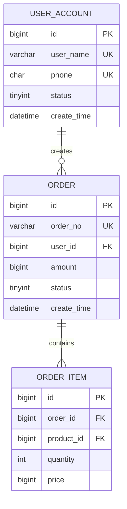

# MySQL 数据库设计规范

- 版本号: v1.0
- 参考标准: 阿里巴巴 Java 开发手册（嵩山版）MySQL 数据库规约
- 适用范围: 所有项目数据库设计与 SQL 编写
- 数据库版本: MySQL 8.0+
- 约束力: **强制**

---

> **TL;DR 核心要点**：
> 1. **库名/表名/字段名**：小写+下划线，禁止数字开头、保留字、复数名词
> 2. **必备字段**：`id`(bigint unsigned)、`create_time`(datetime)、`update_time`(datetime)、`is_deleted`(bigint(20))
> 3. **软删除**：`is_deleted bigint(20) DEFAULT 0`，删除时 `is_deleted=id`，唯一索引用 `(业务字段, is_deleted)`
> 4. **索引命名**：pk_/uk_/idx_ 前缀，复合索引字段顺序与索引列一致
> 5. **禁止timestamp**：时间字段用 `datetime`，禁止 `timestamp`（2038问题）
> 6. **金额用bigint**：以分为单位存储，禁止float/double
> 7. **DDL输出格式**：可直接执行的 `CREATE TABLE` 语句，非纯表格
> 8. **中间表例外**：仅含两个外键ID的纯关联表可省略create_time/update_time

---

## 1. 命名规范

### 1.1 库名规范

1. **【强制】** 库名必须使用小写字母，单词间用下划线分隔，长度不超过 30 个字符。
2. **【强制】** 库名禁止使用 MySQL 保留字。
3. **【推荐】** 库名与应用/服务名称尽量一致。

```
正例：user_service, order_service, product_center
反例：UserService, user-service, userSvc
```

### 1.2 表名规范

1. **【强制】** 表名必须使用小写字母或数字，**禁止数字开头**，**禁止两个下划线中间只出现数字**。
2. **【强制】** 表名不使用复数名词。表名仅表示实体内容，对应 DO 类名也是单数形式。
3. **【强制】** 表名禁止使用 MySQL 保留字（如 `desc`、`range`、`match`、`delayed`、`order`、`group`）。
4. **【推荐】** 表名采用 `业务名称_表的作用` 格式。

```
正例：user_account, order_item, product_category
反例：UserAccount, userAccounts, level_3_name, 1st_table
```

### 1.3 字段名规范

1. **【强制】** 字段名必须使用小写字母或数字，禁止数字开头，禁止两个下划线中间只出现数字。
2. **【强制】** 字段名禁止使用 MySQL 保留字。
3. **【强制】** 表达布尔概念的字段，必须使用 `is_xxx` 命名方式，数据类型为 `unsigned tinyint`（1=是，0=否）。
4. **【推荐】** 字段命名应见名知义，使用完整英文单词，避免过度缩写。
5. **【推荐】** 表示时间的字段统一使用 `_time` 后缀（如 `create_time`、`update_time`）。

```
正例：is_deleted, is_enabled, user_name, create_time
反例：IsDeleted, deletedFlag, uname, crtTm
```

### 1.4 索引命名规范

1. **【强制】** 主键索引命名为 `pk_字段名`。
2. **【强制】** 唯一索引命名为 `uk_字段名`。
3. **【强制】** 普通索引命名为 `idx_字段名`。
4. **【强制】** 复合索引命名为 `idx_字段1_字段2`，字段顺序与索引列顺序一致。

```sql
-- 正例
PRIMARY KEY pk_id (id)
UNIQUE KEY uk_user_name (user_name)
KEY idx_user_id_order_id (user_id, order_id)
```

### 1.5 建表必备字段

1. **【强制】** 每张表必须包含以下三个字段：

| 字段名 | 类型 | 约束 | 说明 |
|--------|------|------|------|
| `id` | `bigint unsigned` | PRIMARY KEY, AUTO_INCREMENT | 主键，步长为 1 |
| `create_time` | `datetime` | NOT NULL, DEFAULT CURRENT_TIMESTAMP | 记录创建时间 |
| `update_time` | `datetime` | NOT NULL, DEFAULT CURRENT_TIMESTAMP ON UPDATE CURRENT_TIMESTAMP | 记录更新时间，修改时自动更新 |

2. **【例外】** 多对多关联中间表（仅包含两个外键 ID 的纯关联表，如 `sys_user_role`、`sys_role_menu`）可省略 `create_time` 和 `update_time` 字段，以简化表结构和提升关联查询性能。

3. **【强制】** 业务表中必须包含 `is_deleted`（逻辑删除标志）字段，类型为 `bigint(20)`。

> **软删除字段设计说明**：`is_deleted` 使用 `bigint(20)` 类型，`0` 表示未删除，已删除记录将该字段设为**记录自身的 ID 值**（即 `is_deleted = id`）。此设计的核心优势是解决唯一索引与逻辑删除的冲突——同一业务字段可存在多条已删除记录（每条 `is_deleted` 值不同），而未删除记录的 `is_deleted` 恒为 `0`，从而在联合唯一索引 `(业务字段, is_deleted)` 上实现精确的唯一性约束。

```sql
-- 建表必备字段模板
`id` bigint unsigned NOT NULL AUTO_INCREMENT COMMENT '主键',
`create_time` datetime NOT NULL DEFAULT CURRENT_TIMESTAMP COMMENT '创建时间',
`update_time` datetime NOT NULL DEFAULT CURRENT_TIMESTAMP ON UPDATE CURRENT_TIMESTAMP COMMENT '更新时间',
`is_deleted` bigint(20) NOT NULL DEFAULT 0 COMMENT '逻辑删除标志：0-未删除，非0-已删除（值为被删除记录的ID）',
PRIMARY KEY (`id`)
```

---

## 2. 数据类型选择规范

### 2.1 整数类型

1. **【强制】** 任何非负数字段必须使用 `unsigned` 修饰。
2. **【推荐】** 根据数据范围选择最小够用的类型，节约存储和索引空间。

| 场景 | 推荐类型 | 无符号范围 |
|------|---------|-----------|
| 布尔标志 | `tinyint unsigned` | 0 ~ 255 |
| 状态/枚举 | `tinyint unsigned` | 0 ~ 255 |
| 年龄/百分比 | `tinyint unsigned` | 0 ~ 255 |
| 排序/数量较小 | `smallint unsigned` | 0 ~ 65,535 |
| 端口号 | `smallint unsigned` | 0 ~ 65,535 |
| 数量/中等范围 | `int unsigned` | 0 ~ 42.9 亿 |
| 主键/金额(分) | `bigint unsigned` | 0 ~ 1.8 × 10^19 |

### 2.2 小数类型

1. **【强制】** 金额及相关精确计算字段**必须使用 `decimal`**，禁止使用 `float` 和 `double`。
2. **【强制】** 货币金额以**最小单位（分）的整数**存储，使用 `bigint`。

```
说明：float 和 double 存在精度损失，比较时可能得到不正确结果。
金额单位约定：数据库存储分为单位（bigint），业务层使用元（BigDecimal），接口传输使用分（Long）。

正例：price bigint COMMENT '价格（单位：分）'
反例：price float COMMENT '价格'
反例：price double COMMENT '价格'
```

### 2.3 字符串类型

1. **【强制】** 字符串长度几乎相等的字段（如手机号、身份证号、UUID），使用 `char` 定长类型。
2. **【强制】** 可变长度字符串使用 `varchar`，长度不超过 5000。
3. **【强制】** 存储长度超过 5000 的文本，使用 `text` 类型，**独立建表**，通过主键关联，避免影响索引效率。
4. **【推荐】** `varchar` 长度按实际需要设置，预留适当扩展空间。

| 场景 | 推荐类型 | 长度 | 说明 |
|------|---------|------|------|
| 手机号 | `char` | 11 | 固定长度 |
| 身份证号 | `char` | 18 | 固定长度 |
| UUID | `char` | 36 | 固定长度 |
| 用户名 | `varchar` | 50 | 变长，按需设定 |
| 邮箱 | `varchar` | 100 | 变长，按需设定 |
| 密码哈希 | `varchar` | 128 | SHA-256 等 |
| URL | `varchar` | 500 | 变长 |
| 描述/备注 | `varchar` | 1000 | 变长 |
| 富文本/文章 | `text` | - | 独立建表 |

### 2.4 日期时间类型

1. **【强制】** 所有时间字段使用 `datetime` 类型，禁止使用 `timestamp`（范围限制、2038 问题）。
2. **【强制】** 仅存储日期的字段使用 `date` 类型。
3. **【推荐】** 存储时间戳使用 `bigint`（毫秒级 UNIX 时间戳），用于日志或对精度要求不高的场景。

| 场景 | 推荐类型 | 说明 |
|------|---------|------|
| 创建/更新时间 | `datetime` | 精确到秒 |
| 生日 | `date` | 仅日期 |
| 过期时间 | `datetime` | 精确到秒 |

### 2.5 JSON 类型

1. **【推荐】** MySQL 8.0+ 可使用 `json` 类型存储非结构化数据。
2. **【强制】** `json` 字段**不得参与索引**，需要查询的属性应提取为独立列。
3. **【推荐】** 仅在数据结构不固定且不需要 SQL 查询的场景使用 `json`。

### 2.6 类型与 Java 映射

| MySQL 类型 | Java 类型 | 说明 |
|-----------|----------|------|
| `tinyint unsigned` | `Integer` | 映射为包装类型 |
| `smallint unsigned` | `Integer` | 映射为包装类型 |
| `int unsigned` | `Long` | unsigned int 需要 Long |
| `bigint unsigned` | `Long` | 映射为包装类型 |
| `decimal(M,N)` | `BigDecimal` | 精确计算 |
| `char / varchar` | `String` | - |
| `datetime` | `LocalDateTime` | Java 8+ 时间 API |
| `date` | `LocalDate` | Java 8+ 时间 API |
| `tinyint(1)` | `Boolean` | MyBatis-Plus 自动映射 |

---

## 3. 索引设计规范

### 3.1 主键规范

1. **【强制】** 每张表必须有主键，使用 `bigint unsigned AUTO_INCREMENT`。
2. **【强制】** 禁止使用 `UUID` 作为聚簇索引主键（页分裂导致性能下降、占用空间大）。
3. **【推荐】** 分布式环境下可使用雪花算法（Snowflake）生成有序的 `bigint` 作为主键。

### 3.2 唯一索引规范

1. **【强制】** 业务上具有唯一特性的字段（含组合字段），**必须创建唯一索引**。
2. **【推荐】** 即使应用层做了校验控制，唯一索引仍然不可省略（防止脏数据）。

```sql
-- 正例：用户名唯一
UNIQUE KEY uk_user_name (user_name)

-- 正例：订单号唯一
UNIQUE KEY uk_order_no (order_no)

-- 正例：组合唯一
UNIQUE KEY uk_user_role (user_id, role_id)
```

### 3.3 复合索引规范

1. **【强制】** 超过三个表**禁止 JOIN**。需要 JOIN 的字段，数据类型必须绝对一致。
2. **【强制】** 多表关联查询时，被关联字段必须有索引。
3. **【强制】** 在 `varchar` 字段上建立索引时，必须指定索引长度，无需对全字段建索引。

```sql
-- 正例：指定前缀索引长度
KEY idx_user_name (user_name(20))
```

4. **【推荐】** 利用覆盖索引进行查询，避免回表。`explain` 结果的 `Extra` 列出现 `Using index` 为最佳。
5. **【推荐】** 有 `ORDER BY` 的查询，`ORDER BY` 的字段应放在复合索引最后，利用索引有序性避免 `file_sort`。

```sql
-- 正例：WHERE a=? AND b=? ORDER BY c → 索引 idx_a_b_c
KEY idx_status_create_time (status, create_time)
-- 查询：WHERE status=1 ORDER BY create_time
```

### 3.4 索引使用禁忌

1. **【强制】** 页面搜索**严禁左模糊或全模糊**查询，如需使用请走搜索引擎（Elasticsearch）。
2. **【强制】** 禁止在索引列上使用函数或计算，否则索引失效。

```sql
-- 反例：索引失效
WHERE YEAR(create_time) = 2026
WHERE id + 1 = 100
WHERE LOWER(user_name) = 'admin'

-- 正例：索引有效
WHERE create_time >= '2026-01-01' AND create_time < '2027-01-01'
WHERE id = 99
WHERE user_name = 'admin'
```

3. **【强制】** 禁止 `!=` 或 `<>` 作为主要查询条件（索引无法使用）。
4. **【强制】** 禁止隐式类型转换（如 `varchar` 列用数字查询 `WHERE phone = 13800138000`）。
5. **【推荐】** 单表索引数量不超过 5 个，单个索引字段数不超过 5 个。
6. **【推荐】** 区分度低的字段（如性别、状态只有 2-3 个值）不建议单独建索引。

---

## 4. 表结构设计规范

### 4.1 字段设计原则

1. **【强制】** 字段允许适当冗余以提高查询性能，但必须满足：
   - 不是频繁修改的字段
   - 不是 `varchar` 超长字段，更不能是 `text` 字段
   - 冗余字段必须有数据一致性保障机制
2. **【强制】** 所有字段必须添加 `COMMENT` 注释。
3. **【推荐】** 字段含义或状态值变更时，必须及时更新字段注释。
4. **【推荐】** 表的字段数不超过 30 个，超过应考虑垂直拆分。

### 4.2 默认值与空值约束

1. **【强制】** 所有字段尽量使用 `NOT NULL` + 默认值，避免 `NULL` 值带来的索引和统计问题。
2. **【强制】** 字符串类型默认值使用空字符串 `''`，禁止默认为 `NULL`。
3. **【强制】** 数值类型默认值使用 `0`。
4. **【强制】** 布尔类型默认值明确（`0` 或 `1`），不使用 `NULL`。
5. **【推荐】** 仅在业务上确实需要区分"未填写"和"空值"时才允许 `NULL`。

```sql
-- 正例
`status` tinyint unsigned NOT NULL DEFAULT 0 COMMENT '状态：0-禁用，1-启用',
`nick_name` varchar(50) NOT NULL DEFAULT '' COMMENT '昵称',
`remark` varchar(500) DEFAULT '' COMMENT '备注',
```

### 4.3 外键使用规范

1. **【强制】** **禁止使用数据库物理外键**（`FOREIGN KEY` 约束）。
2. **【强制】** 表间关系通过应用层逻辑保证，数据库仅存储关联 ID。
3. **【推荐】** 在关联字段上建立索引以提升 JOIN 性能。

```
说明：
- 外键会导致死锁风险增加
- 外键影响插入/更新/删除性能
- 外键使得数据迁移和分库分表困难
- 应用层保证一致性更灵活
```

### 4.4 字段长度规范

1. **【强制】** 字段长度按实际需要设定，禁止盲目使用最大值。
2. **【推荐】** 预留 20%-30% 的扩展空间。

| 常见字段 | 推荐长度 | 说明 |
|---------|---------|------|
| 用户名 | `varchar(50)` | 足够覆盖 |
| 手机号 | `char(11)` | 固定长度 |
| 邮箱 | `varchar(100)` | RFC 5321 上限 254 |
| 密码哈希 | `varchar(128)` | SHA-256 hex |
| 姓名 | `varchar(50)` | 覆盖中外姓名 |
| 地址 | `varchar(200)` | 详细地址 |
| 标题 | `varchar(200)` | 文章/订单标题 |
| URL | `varchar(500)` | 浏览器支持 2000+ |

### 4.5 建表语句模板

```sql
CREATE TABLE `user_account` (
	`id` bigint unsigned NOT NULL AUTO_INCREMENT COMMENT '主键',
	`user_name` varchar(50) NOT NULL DEFAULT '' COMMENT '用户名',
	`phone` char(11) NOT NULL DEFAULT '' COMMENT '手机号',
	`email` varchar(100) NOT NULL DEFAULT '' COMMENT '邮箱',
	`password_hash` varchar(128) NOT NULL DEFAULT '' COMMENT '密码哈希',
	`status` tinyint unsigned NOT NULL DEFAULT 1 COMMENT '状态：0-禁用，1-启用',
	`is_deleted` bigint(20) NOT NULL DEFAULT 0 COMMENT '逻辑删除标志：0-未删除，非0-已删除（值为被删除记录的ID）',
	`create_time` datetime NOT NULL DEFAULT CURRENT_TIMESTAMP COMMENT '创建时间',
	`update_time` datetime NOT NULL DEFAULT CURRENT_TIMESTAMP ON UPDATE CURRENT_TIMESTAMP COMMENT '更新时间',
	PRIMARY KEY (`id`),
	UNIQUE KEY `uk_user_name_deleted` (`user_name`, `is_deleted`),
	UNIQUE KEY `uk_phone_deleted` (`phone`, `is_deleted`),
	KEY `idx_email` (`email`),
	KEY `idx_status_create_time` (`status`, `create_time`)
) ENGINE=InnoDB DEFAULT CHARSET=utf8mb4 COLLATE=utf8mb4_general_ci COMMENT='用户账号表';
```

### 4.6 字符集与存储引擎

1. **【强制】** 所有表使用 `utf8mb4` 字符集，支持完整 Unicode（包括 emoji）。
2. **【强制】** 排序规则使用 `utf8mb4_general_ci`（不区分大小写查询）或 `utf8mb4_bin`（区分大小写）。
3. **【强制】** 存储引擎统一使用 `InnoDB`（支持事务、行锁、外键、MVCC）。

---

## 5. SQL 语句编写规范

### 5.1 SELECT 规范

1. **【强制】** 禁止使用 `SELECT *`，必须明确列出需要查询的字段。
2. **【强制】** 严禁左模糊 `LIKE '%xxx'` 或全模糊 `LIKE '%xxx%'` 查询（索引无法使用）。
3. **【推荐】** 右模糊查询 `LIKE 'xxx%'` 可以使用索引。
4. **【强制】** 大数据量查询必须使用 `LIMIT` 分页，禁止无限制结果集。
5. **【推荐】** 避免在 `WHERE` 子句中对字段进行函数操作。

```sql
-- 反例
SELECT * FROM user_account WHERE YEAR(create_time) = 2026;
SELECT * FROM user_account WHERE user_name LIKE '%admin%';

-- 正例
SELECT id, user_name, phone, status FROM user_account
WHERE create_time >= '2026-01-01' AND create_time < '2027-01-01';
SELECT id, user_name, phone, status FROM user_account
WHERE user_name LIKE 'admin%';
```

### 5.2 INSERT 规范

1. **【强制】** `INSERT` 语句必须明确指定列名，禁止省略列名。
2. **【推荐】** 批量插入使用单条 `INSERT INTO ... VALUES (...), (...), (...)` 代替多条单行插入。
3. **【推荐】** 批量插入每次不超过 500 行。

```sql
-- 反例
INSERT INTO user_account VALUES (NULL, 'admin', '13800138000', ...);

-- 正例
INSERT INTO user_account (user_name, phone, email, password_hash, status)
VALUES ('admin', '13800138000', 'admin@example.com', 'xxx', 1);
```

### 5.3 UPDATE 规范

1. **【强制】** `UPDATE` / `DELETE` 语句必须带 `WHERE` 条件。
2. **【强制】** `UPDATE` 必须同时更新 `update_time` 字段（或依赖数据库 `ON UPDATE CURRENT_TIMESTAMP`）。
3. **【推荐】** 使用乐观锁（版本号机制）防止并发覆盖。

```sql
-- 正例：乐观锁更新
UPDATE user_account
SET nick_name = '新昵称', version = version + 1
WHERE id = 1 AND version = 5;
```

### 5.4 DELETE 规范

1. **【强制】** 业务数据禁止物理删除，统一使用逻辑删除（`is_deleted = 记录ID`）。
2. **【推荐】** 仅日志表、临时表等允许物理删除。
3. **【强制】** 物理删除必须带 `WHERE` 条件。
4. **【强制】** 逻辑删除时将 `is_deleted` 字段设置为**该记录的 `id` 值**，而非固定值 `1`。这样每条已删除记录的 `is_deleted` 值唯一，可与联合唯一索引配合解决删除后重新创建同名记录的冲突问题。

```sql
-- 正例：逻辑删除（将 is_deleted 设为记录ID）
UPDATE user_account SET is_deleted = id WHERE id = 1;

-- 反例：使用固定值1（已废弃，无法支持联合唯一索引方案）
-- UPDATE user_account SET is_deleted = 1 WHERE id = 1;
```

5. **【强制】** 唯一索引与逻辑删除的冲突解决方案：将唯一索引改为联合唯一索引 `(业务字段, is_deleted)`。
   - 未删除记录：`is_deleted = 0`，联合唯一索引确保同一业务字段仅一条未删除记录
   - 已删除记录：`is_deleted = 记录ID`（每条唯一），联合唯一索引允许多条同名已删除记录共存
   - 删除后重建同名记录：新记录 `is_deleted = 0`，与旧记录 `is_deleted = 旧ID` 不冲突

```sql
-- 正例：联合唯一索引 + ID型逻辑删除
UNIQUE KEY uk_username_deleted (username, is_deleted)

-- 反例：单一唯一索引（删除后无法重建同名记录）
-- UNIQUE KEY uk_username (username)
```

### 5.5 JOIN 规范

1. **【强制】** 超过三个表禁止 `JOIN`。
2. **【强制】** `JOIN` 字段的数据类型必须绝对一致。
3. **【强制】** 被关联字段必须有索引。
4. **【推荐】** 优先使用 `INNER JOIN`，明确语义。避免使用隐式 `JOIN`（逗号连接）。

### 5.6 分页规范

1. **【强制】** 分页查询禁止仅使用 `LIMIT offset, size`（深度分页性能极差）。
2. **【推荐】** 使用游标分页（基于有序主键的 `WHERE id > last_id LIMIT size`）。

```sql
-- 反例：深度分页（扫描并丢弃大量行）
SELECT id, user_name FROM user_account LIMIT 100000, 10;

-- 正例：游标分页
SELECT id, user_name FROM user_account WHERE id > 100000 ORDER BY id LIMIT 10;
```

### 5.7 事务规范

1. **【强制】** 事务中禁止包含 RPC 调用、文件操作等耗时操作。
2. **【强制】** 事务粒度尽可能小，避免长事务。
3. **【推荐】** 查询操作不使用事务（除非需要一致性读）。

---

## 6. 分区与分表规范

### 6.1 分区策略

1. **【推荐】** 单表行数超过 **500 万行**或单表容量超过 **2 GB**，考虑分区或分表。
2. **【推荐】** 预计三年内数据量达不到该级别，**不要提前分区/分表**。
3. **【推荐】** 按时间范围分区适用于日志表、流水表等具有明显时间特征的数据。

```sql
-- 正例：按月分区
CREATE TABLE `order_record` (
	`id` bigint unsigned NOT NULL AUTO_INCREMENT,
	`order_no` varchar(64) NOT NULL DEFAULT '' COMMENT '订单号',
	`user_id` bigint unsigned NOT NULL COMMENT '用户ID',
	`amount` bigint NOT NULL DEFAULT 0 COMMENT '金额（分）',
	`create_time` datetime NOT NULL DEFAULT CURRENT_TIMESTAMP,
	PRIMARY KEY (`id`, `create_time`)
) ENGINE=InnoDB DEFAULT CHARSET=utf8mb4
PARTITION BY RANGE (TO_DAYS(create_time)) (
	PARTITION p202601 VALUES LESS THAN (TO_DAYS('2026-02-01')),
	PARTITION p202602 VALUES LESS THAN (TO_DAYS('2026-03-01')),
	PARTITION p_future VALUES LESS THAN MAXVALUE
);
```

### 6.2 分表策略

1. **【推荐】** 水平分表优先考虑取模分表（如按用户 ID 取模）。
2. **【推荐】** 分表数量选择 2 的幂次方（如 4、8、16、32、64）。
3. **【推荐】** 使用 ShardingSphere 等中间件管理分表路由。

| 分表方式 | 适用场景 | 示例 |
|---------|---------|------|
| 取模分表 | 均匀分布的数据 | `order_0`, `order_1`, ..., `order_15` |
| 按时间分表 | 日志/流水类数据 | `log_202601`, `log_202602` |
| 按地域分表 | 地域特征明显的数据 | `user_cn`, `user_us` |

### 6.3 垂直拆分

1. **【推荐】** 字段数超过 30 个的表考虑垂直拆分。
2. **【推荐】** 将不常用的大字段（`text`、`json`）拆到扩展表。
3. **【推荐】** 将频繁查询的字段与不常查询的字段分离。

```
正例：
user_account (id, user_name, phone, password_hash, status, create_time, update_time)
user_profile (id, user_id, avatar_url, nick_name, gender, birthday, bio_text)
```

---

## 7. 安全规范

### 7.1 权限控制

1. **【强制】** 应用程序使用专用数据库账号，**禁止使用 root 账号**连接数据库。
2. **【强制】** 数据库账号权限遵循最小权限原则：
   - 应用账号：`SELECT`、`INSERT`、`UPDATE`、`DELETE`
   - DDL 操作账号：独立管理，应用账号禁止 `DROP`、`ALTER`、`TRUNCATE`
   - 只读账号（报表/BI）：仅 `SELECT`
3. **【强制】** 禁止在代码中硬编码数据库密码，使用配置中心或环境变量管理。
4. **【推荐】** 生产环境的数据库账号密码定期轮换。

### 7.2 敏感数据加密

1. **【强制】** 密码字段必须存储单向哈希值（如 bcrypt、Argon2），**禁止存储明文**。
2. **【强制】** 身份证号、银行卡号等敏感信息必须加密存储。
3. **【推荐】** 手机号脱敏显示（`138****8000`），数据库可存储完整值（加密）或脱敏值。
4. **【推荐】** 使用 AES-256 对称加密敏感数据，密钥通过 KMS（密钥管理服务）管理。

| 数据类型 | 存储方式 | 说明 |
|---------|---------|------|
| 密码 | bcrypt 哈希 | 不可逆，加盐 |
| 身份证号 | AES 加密 | 可逆，业务需要 |
| 手机号 | 明文或 AES 加密 | 按合规要求 |
| 银行卡号 | AES 加密 | 可逆，严格加密 |
| 邮箱 | 明文或 AES 加密 | 按合规要求 |

### 7.3 SQL 注入防护

1. **【强制】** 所有 SQL 查询必须使用**参数化查询（PreparedStatement）**，禁止拼接 SQL。
2. **【强制】** MyBatis 中使用 `#{}` 占位符，**禁止使用 `${}`** 传入用户输入。
3. **【强制】** 动态表名、动态列名等场景，必须在应用层做白名单校验。

```java
// 正例：MyBatis 参数化查询
@Select("SELECT id, user_name FROM user_account WHERE user_name = #{userName}")
List<UserAccount> selectByUserName(@Param("userName") String userName);

// 反例：字符串拼接（SQL 注入风险）
@Select("SELECT id, user_name FROM user_account WHERE user_name = '${userName}'")
List<UserAccount> selectByUserName(@Param("userName") String userName);
```

4. **【推荐】** 前端输入校验 + 后端参数校验双重防护。
5. **【推荐】** 部署 WAF（Web 应用防火墙）作为额外防线。

### 7.4 数据备份

1. **【强制】** 生产数据库必须配置定时全量备份 + 增量备份（binlog）。
2. **【推荐】** 备份保留周期至少 30 天。
3. **【推荐】** 定期进行备份恢复演练。

---

## 8. 技术设计文档中的数据库设计模板

架构师在产出技术设计文档时，数据库设计部分应包含以下内容：

### 8.1 ER 图

使用 Mermaid `erDiagram` 语法描述实体关系：



### 8.2 表设计

每个表需要提供可直接执行的 MySQL DDL 语句，包含完整字段定义、主键、索引和表注释：

```sql
CREATE TABLE `user_account` (
  `id` bigint unsigned NOT NULL AUTO_INCREMENT COMMENT '主键',
  `user_name` varchar(50) NOT NULL DEFAULT '' COMMENT '用户名',
  `phone` char(11) NOT NULL DEFAULT '' COMMENT '手机号',
  `email` varchar(100) NOT NULL DEFAULT '' COMMENT '邮箱',
  `password_hash` varchar(128) NOT NULL DEFAULT '' COMMENT '密码哈希',
  `status` tinyint unsigned NOT NULL DEFAULT 1 COMMENT '状态：0-禁用，1-启用',
  `is_deleted` bigint(20) NOT NULL DEFAULT 0 COMMENT '逻辑删除标志：0-未删除，非0-已删除（值为被删除记录的ID）',
  `create_time` datetime NOT NULL DEFAULT CURRENT_TIMESTAMP COMMENT '创建时间',
  `update_time` datetime NOT NULL DEFAULT CURRENT_TIMESTAMP ON UPDATE CURRENT_TIMESTAMP COMMENT '更新时间',
  PRIMARY KEY (`id`),
  UNIQUE KEY `uk_user_name_deleted` (`user_name`, `is_deleted`),
  UNIQUE KEY `uk_phone_deleted` (`phone`, `is_deleted`),
  KEY `idx_email` (`email`),
  KEY `idx_status_create_time` (`status`, `create_time`)
) ENGINE=InnoDB DEFAULT CHARSET=utf8mb4 COMMENT='用户账号表';
```

### 8.3 索引设计

索引定义应直接内嵌在 `CREATE TABLE` 语句中（见 8.2 示例），不再单独列出索引表格。如需补充说明，可在 DDL 后以文字列表形式列出各表索引清单及设计理由。

---

> **交叉引用**：
> - 后端编码规范详见 `../backend-engineer/STANDARDS.md`
> - 后端安全/SQL注入防护详见 `../backend-engineer/guides/08-security-and-misc.md`
> - 项目技术栈详见 `../backend-engineer/guides/01-tech-stack.md`
