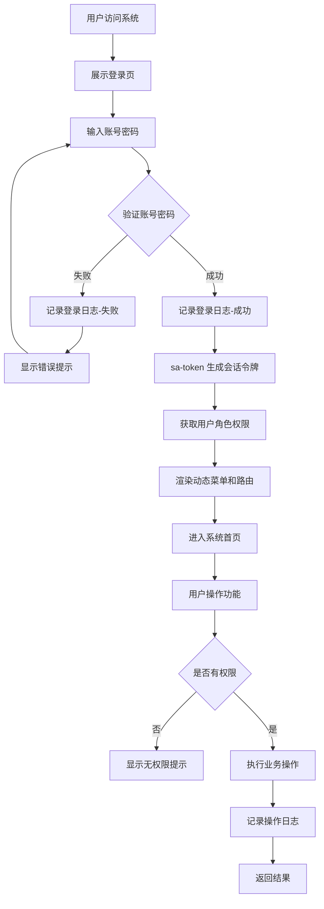

# PRD文档（产品需求文档）
- 版本号: v1.0.0
- 作者: 产品经理
- 日期: 2026-05-04
- 关联需求文档: docs/v1.0.0/需求采集文档.md

## 1. 产品概述

### 1.1 产品目标
打造一款轻量级、现代化的通用后台管理系统基础模板，作为公司内部标准化开发框架。产品定位于"够用且好用"，在覆盖后台系统核心基础能力的同时，保持代码结构的清晰简洁，便于后续业务定制和扩展。

### 1.2 目标用户
| 用户类型 | 核心诉求 | 使用场景 |
|---------|---------|---------|
| 后端开发工程师 | 快速获得用户权限、日志、配置等基础模块 | 在新项目中直接引用或复制基础代码 |
| 全栈开发工程师 | 获得前后端完整的基础能力 | 独立搭建完整业务系统 |
| 运营管理人员 | 通过界面进行系统配置和数据管理 | 日常运营中的用户、配置、公告管理 |

### 1.3 产品价值
- **效率提升**：避免每个新项目重复开发用户、权限、日志等基础模块
- **标准统一**：公司内部项目采用统一的技术栈和代码规范
- **降低门槛**：新成员可通过模板快速理解公司技术规范
- **可扩展性**：清晰的模块化设计，便于按需扩展

## 2. 竞品分析

| 竞品 | 核心功能 | 优势 | 不足 | 借鉴点 |
|------|---------|------|------|--------|
| **若依 RuoYi** | RBAC权限、代码生成、系统监控、定时任务、日志管理 | 功能完备、文档齐全、社区活跃、版本迭代稳定 | 前端界面风格偏传统（Element UI 默认风格）、代码生成器过度依赖、部分模块冗余 | RBAC权限模型设计、模块划分方式、日志记录机制 |
| **JeecgBoot** | 低代码平台、AI辅助开发、在线表单、报表设计 | 低代码能力强、可视化开发、AI生成代码 | 过于复杂、学习成本高、不适合作为基础模板、资源占用大 | 前端组件化设计思路、表单设计模式 |
| **V3 Admin Vite** | Vue3+Vite后台模板、权限路由、动态菜单、主题切换 | 现代化UI、轻量、工程实践优秀、TypeScript支持好 | 仅为前端模板，无后端能力、无业务功能 | 前端工程结构、路由权限实现、界面风格 |

### 2.1 差异化定位
本产品区别于若依的"大而全"和 JeecgBoot 的"低代码平台"定位，采用"**精简核心、现代体验、易于扩展**"的产品策略：
- 只保留最基础的 12 个核心模块，去掉代码生成器、系统监控等高级功能
- 前端基于 V3 Admin Vite 现代化模板，提供更好的视觉体验和交互体验
- 后端采用清晰的模块化分层，便于业务团队理解和扩展

## 3. 功能规格

### 3.1 用户管理
- **功能描述**: 系统用户的全生命周期管理，包括创建、编辑、禁用、删除、密码重置等
- **优先级**: P0
- **用户流程**:
  1. 管理员进入用户管理页面
  2. 查看用户列表（支持分页、条件筛选）
  3. 点击"新增"填写用户信息（用户名、昵称、邮箱、手机号、密码、部门、角色、状态）
  4. 保存后用户可登录系统
  5. 可对已有用户进行编辑、禁用/启用、删除、重置密码操作
- **交互设计**:
  - 列表页：表格展示，支持列排序、分页、关键词搜索、状态筛选
  - 新增/编辑：弹窗表单，包含表单校验（用户名唯一性、邮箱格式、手机号格式）
  - 删除：二次确认弹窗，超级管理员不可删除
  - 重置密码：弹窗确认，重置为默认密码或随机密码
- **业务规则**:
  - 用户名唯一，不可重复
  - 超级管理员账号不可删除、不可禁用
  - 禁用用户无法登录系统
  - 密码重置后，用户首次登录可强制修改密码（可选配置）

### 3.2 角色管理
- **功能描述**: 角色的创建与权限分配，支持菜单权限和按钮权限
- **优先级**: P0
- **用户流程**:
  1. 管理员进入角色管理页面
  2. 查看角色列表
  3. 点击"新增"填写角色信息（角色名称、角色编码、显示顺序、状态、备注）
  4. 为角色分配菜单权限（树形选择器勾选）
  5. 为角色分配按钮权限（对应菜单下的权限标识列表）
  6. 保存后，拥有该角色的用户获得对应权限
- **交互设计**:
  - 列表页：表格展示角色信息
  - 权限分配：树形组件展示菜单结构，父节点勾选自动关联子节点；按钮权限以标签/复选框形式展示
  - 角色编码唯一，用于系统内部标识
- **业务规则**:
  - 角色编码唯一，不可重复
  - 一个角色可分配多个菜单和多个按钮权限
  - 超级管理员角色拥有全部权限，不可修改

### 3.3 菜单管理
- **功能描述**: 系统菜单和按钮权限标识的配置管理
- **优先级**: P0
- **用户流程**:
  1. 管理员进入菜单管理页面
  2. 查看树形菜单结构
  3. 新增菜单：选择父节点、填写菜单名称、菜单类型（目录/菜单/按钮）、路由地址、组件路径、权限标识、图标、排序
  4. 保存后，前端动态路由和权限控制生效
- **交互设计**:
  - 树形表格展示菜单层级关系
  - 支持拖拽排序或手动输入排序值
  - 菜单类型选择后动态显示/隐藏相关字段（目录无需组件路径，按钮无需路由地址）
  - 图标选择器支持图标预览
- **业务规则**:
  - 菜单分为三种类型：目录（仅分组，无页面）、菜单（有对应页面）、按钮（操作权限）
  - 目录和菜单控制页面访问权限，按钮控制操作权限
  - 菜单名称和权限标识在同一层级下唯一
  - 删除菜单时，如果存在子菜单，需先删除子菜单或确认级联删除

### 3.4 部门管理
- **功能描述**: 组织机构的树形管理
- **优先级**: P0
- **用户流程**:
  1. 管理员进入部门管理页面
  2. 查看部门树形结构
  3. 新增/编辑部门信息（部门名称、父部门、负责人、联系电话、邮箱、排序、状态）
  4. 保存后部门结构即时更新
- **交互设计**:
  - 左侧树形结构 + 右侧表格（或纯树形表格）
  - 支持展开/折叠全部节点
  - 父部门选择器使用树形下拉
- **业务规则**:
  - 部门支持无限层级
  - 部门名称在同一父部门下唯一
  - 不可将自己或自己的子部门设为父部门（防循环依赖）

### 3.5 岗位管理
- **功能描述**: 用户职务的配置管理
- **优先级**: P1
- **用户流程**:
  1. 管理员进入岗位管理页面
  2. 查看岗位列表
  3. 新增/编辑岗位信息（岗位编码、岗位名称、显示顺序、状态、备注）
  4. 保存后可在用户管理中选择岗位
- **交互设计**:
  - 标准CRUD表格页面
  - 岗位编码唯一校验
- **业务规则**:
  - 岗位编码唯一
  - 岗位与用户为一对多关系

### 3.6 字典管理
- **功能描述**: 系统枚举值和固定数据的统一管理
- **优先级**: P1
- **用户流程**:
  1. 管理员进入字典管理页面
  2. 查看字典类型列表
  3. 新增字典类型（字典名称、字典类型编码、状态、备注）
  4. 点击字典类型的"数据"按钮，进入字典数据管理
  5. 新增字典数据（数据标签、数据键值、显示排序、状态、备注）
  6. 前端通过字典类型编码获取字典数据用于下拉框等场景
- **交互设计**:
  - 类型列表页 + 数据列表页（二级页面）
  - 字典数据支持拖拽排序
- **业务规则**:
  - 字典类型编码唯一
  - 同一字典类型下的数据键值唯一
  - 禁用的字典数据不在前端展示

### 3.7 参数配置
- **功能描述**: 系统运行参数的键值对管理
- **优先级**: P1
- **用户流程**:
  1. 管理员进入参数配置页面
  2. 查看参数列表
  3. 新增/编辑参数（参数名称、参数键名、参数键值、系统内置标记、备注）
  4. 保存后参数即时生效（通过缓存或动态读取）
- **交互设计**:
  - 标准CRUD表格页面
  - 系统内置参数标记为不可删除
- **业务规则**:
  - 参数键名唯一
  - 系统内置参数不可删除，防止误操作导致系统异常

### 3.8 通知公告
- **功能描述**: 系统公告的发布与管理，支持站内消息提醒
- **优先级**: P1
- **用户流程**:
  1. 运营人员进入通知公告页面
  2. 新增公告（标题、类型、内容、状态）
  3. 发布公告后，所有在线用户在顶部导航栏收到消息提醒
  4. 用户点击消息铃铛查看公告列表，可标记已读
  5. 运营人员可编辑、撤回、删除公告
- **交互设计**:
  - 公告列表页：展示标题、类型、状态、发布时间、发布人
  - 公告内容编辑：富文本编辑器（基础版）
  - 顶部导航栏消息铃铛：显示未读数量，下拉展示公告列表
  - 公告详情：弹窗或抽屉展示
- **业务规则**:
  - 公告分为通知和公告两种类型
  - 草稿状态仅自己可见，发布后全员可见
  - 已读状态按用户维度记录
  - 撤回后公告对用户不可见

### 3.9 操作日志
- **功能描述**: 自动记录用户的系统操作行为
- **优先级**: P1
- **用户流程**:
  1. 系统自动拦截并记录用户的增删改操作
  2. 管理员进入操作日志页面
  3. 查看日志列表，支持按操作人、时间范围、操作模块、操作类型筛选
  4. 可导出日志为 Excel
  5. 可清理指定时间范围前的日志
- **交互设计**:
  - 表格展示：操作模块、操作类型、请求方式、操作人员、主机地址、操作状态、操作时间
  - 展开行或详情弹窗展示请求参数和返回结果
  - 批量清理：选择时间范围，确认后清理
- **业务规则**:
  - 自动记录，无需手动操作
  - 查询操作可不记录或简化记录（配置化）
  - 日志保留30天，超期可清理

### 3.10 登录日志
- **功能描述**: 自动记录用户登录和登出行为
- **优先级**: P1
- **用户流程**:
  1. 用户登录/登出时系统自动记录
  2. 管理员进入登录日志页面
  3. 查看日志列表，支持按用户名、IP、时间范围、登录状态筛选
  4. 可导出和清理日志
- **交互设计**:
  - 表格展示：用户名称、IP地址、登录地点、浏览器、操作系统、登录状态、操作信息、登录时间
- **业务规则**:
  - 登录成功和失败均记录
  - 登出操作记录

### 3.11 文件上传管理
- **功能描述**: 系统文件的统一上传、存储和管理
- **优先级**: P1
- **用户流程**:
  1. 用户点击上传按钮选择文件
  2. 系统校验文件类型和大小
  3. 上传成功后返回文件访问地址
  4. 管理员可在文件管理页面查看、下载、删除文件
- **交互设计**:
  - 上传组件：拖拽上传或点击上传，显示上传进度
  - 文件管理页：缩略图/列表展示，支持预览、下载、删除
- **业务规则**:
  - 单文件大小不超过50MB
  - 支持格式：图片（jpg/png/gif）、文档（pdf/doc/docx/xls/xlsx）、压缩包（zip/rar）
  - 非法格式文件拒绝上传

### 3.12 个人中心
- **功能描述**: 用户自助管理个人信息
- **优先级**: P1
- **用户流程**:
  1. 用户点击顶部头像进入个人中心
  2. 查看和编辑基本信息（头像、昵称、邮箱、手机号）
  3. 修改密码（需验证原密码）
  4. 查看个人登录历史
  5. 查看站内消息并标记已读
- **交互设计**:
  - 左侧标签页导航：基本信息、修改密码、登录历史、我的消息
  - 头像上传：支持裁剪预览
  - 密码修改：原密码、新密码、确认新密码三栏，密码强度提示
- **业务规则**:
  - 邮箱和手机号需校验格式
  - 修改密码后当前会话保持，下次登录使用新密码

## 4. 用户流程图

### 4.1 系统登录与访问流程

### 4.2 权限分配流程

## 5. 页面/界面设计说明

### 5.1 登录页
- **页面描述**: 系统统一入口，简洁美观的登录界面
- **核心元素**: 系统Logo和名称、用户名输入框、密码输入框、验证码（可选）、登录按钮、记住密码复选框
- **交互行为**: 表单校验、登录加载状态、错误提示
- **状态说明**: 正常态、加载态、错误态

### 5.2 系统布局框架
- **页面描述**: 登录后的主界面布局
- **核心元素**:
  - 顶部导航栏：折叠侧边栏按钮、面包屑导航、全屏切换、消息铃铛、用户头像下拉菜单（个人中心、布局设置、退出登录）
  - 左侧侧边栏：动态菜单树（支持折叠/展开）、Logo区域
  - 主内容区：标签页导航（支持多标签切换、关闭）、页面内容区
  - 页脚：版权信息（可选）
- **交互行为**: 侧边栏折叠/展开、菜单项点击跳转、标签页切换和关闭

### 5.3 用户管理页
- **页面描述**: 用户列表和管理的CRUD页面
- **核心元素**: 搜索区域（用户名、手机号、状态、创建时间）、操作按钮区（新增、导出、删除批量）、数据表格、分页组件
- **交互行为**: 条件查询、分页切换、行内操作（编辑/删除/重置密码）、弹窗表单

### 5.4 角色管理页
- **页面描述**: 角色列表和权限分配页面
- **核心元素**: 角色表格、权限分配抽屉/弹窗（菜单权限树 + 按钮权限列表）
- **交互行为**: 树形权限勾选、父子节点联动、保存权限分配

### 5.5 菜单管理页
- **页面描述**: 菜单树形管理和配置页面
- **核心元素**: 树形表格（或左树右表）、菜单表单（根据类型动态字段）
- **交互行为**: 树形展开折叠、拖拽排序、类型切换动态表单

### 5.6 日志管理页
- **页面描述**: 操作日志和登录日志查询页面
- **核心元素**: 多条件筛选区（操作人、模块、类型、时间范围）、数据表格、导出按钮、清理按钮
- **交互行为**: 时间范围选择、展开详情行、导出Excel

## 6. 非功能需求

### 6.1 性能指标
- 页面首次加载时间 <= 2s（前端优化后）
- API 响应时间 P95 <= 500ms
- 列表查询 P95 <= 1s
- 支持同时在线用户 1000 人

### 6.2 安全要求
- 所有接口需经过 sa-token 认证校验
- 密码采用 BCrypt 加密存储
- 登录失败次数限制（连续5次失败锁定15分钟）
- 敏感操作（删除、重置密码）需二次确认
- SQL注入防护（MyBatis-Plus参数化查询）
- XSS防护（前端转义 + 后端校验）

### 6.3 兼容性要求
- 前端兼容 Chrome、Edge、Firefox、Safari 最新两个主版本
- 支持响应式布局，适配 1366x768 及以上分辨率
- 后端兼容 Java 21 + Spring Boot 3.3.2

## 7. 优先级排期

| 功能模块 | 优先级 | 说明 |
|---------|--------|------|
| 用户管理 | P0 | 权限体系基础 |
| 角色管理 | P0 | 权限体系基础 |
| 菜单管理 | P0 | 权限体系基础 |
| 部门管理 | P0 | 权限体系基础 |
| 岗位管理 | P1 | 用户补充信息 |
| 字典管理 | P1 | 系统基础数据 |
| 参数配置 | P1 | 系统配置能力 |
| 通知公告 | P1 | 运营能力 |
| 操作日志 | P1 | 审计能力 |
| 登录日志 | P1 | 审计能力 |
| 文件上传管理 | P1 | 文件资源能力 |
| 个人中心 | P1 | 用户体验 |

## 8. 术语表

| 术语 | 解释 |
|------|------|
| RBAC | Role-Based Access Control，基于角色的访问控制 |
| sa-token | 轻量级 Java 权限认证框架 |
| CRUD | Create（创建）、Read（读取）、Update（更新）、Delete（删除） |
| P0/P1/P2 | 需求优先级，P0为最高优先级 |
| MVP | Minimum Viable Product，最小可行产品 |
| 权限标识 | 用于标识按钮或接口权限的字符串，如 system:user:add |
| 树形结构 | 层级化的数据结构，支持父子关系，常用于部门、菜单展示 |
| 动态路由 | 前端根据后端返回的菜单权限动态生成的路由配置 |
| 富文本编辑器 | 支持格式化文本、图片等内容的编辑器 |
| 响应式布局 | 页面能自适应不同屏幕尺寸的布局方案 |

## 9. 评审记录

| 评审人 | 评审意见 | 评审结果 |
|--------|---------|---------|
| | | |

## 10. 变更记录

| 版本 | 变更内容 | 变更日期 |
|------|---------|---------|
| v1.0.0 | 初稿 | 2026-05-04 |
