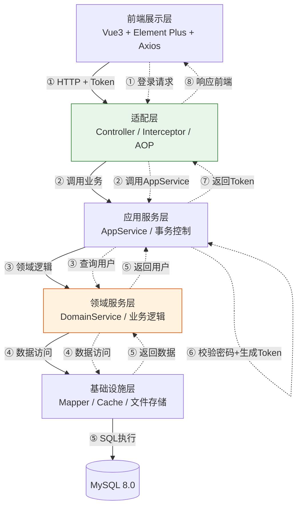
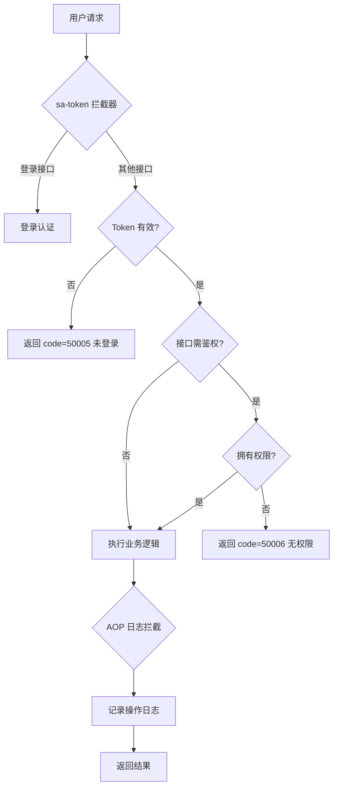
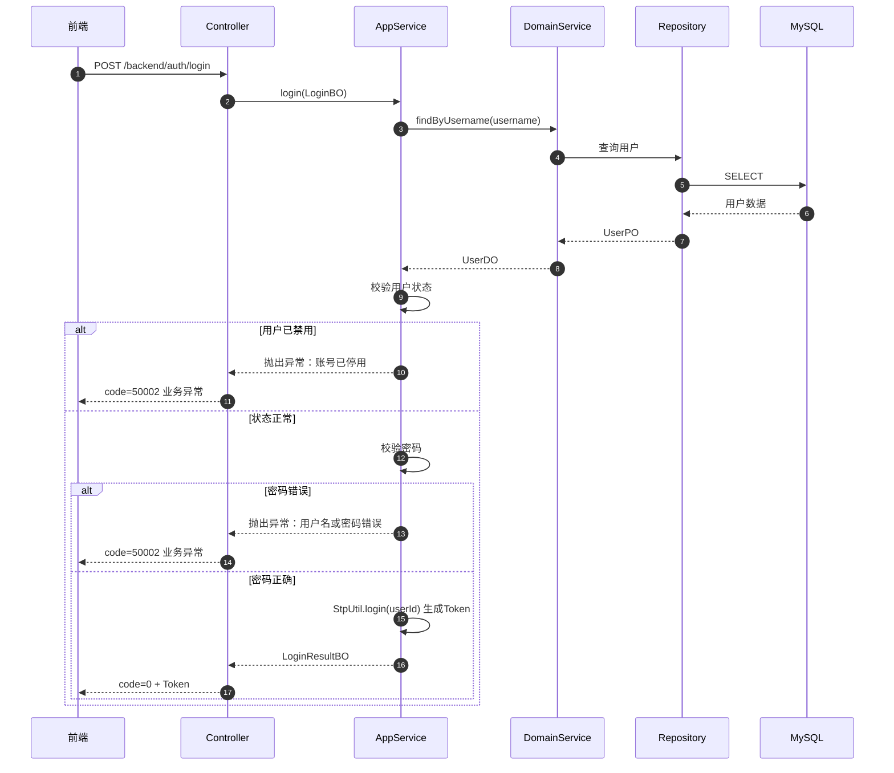
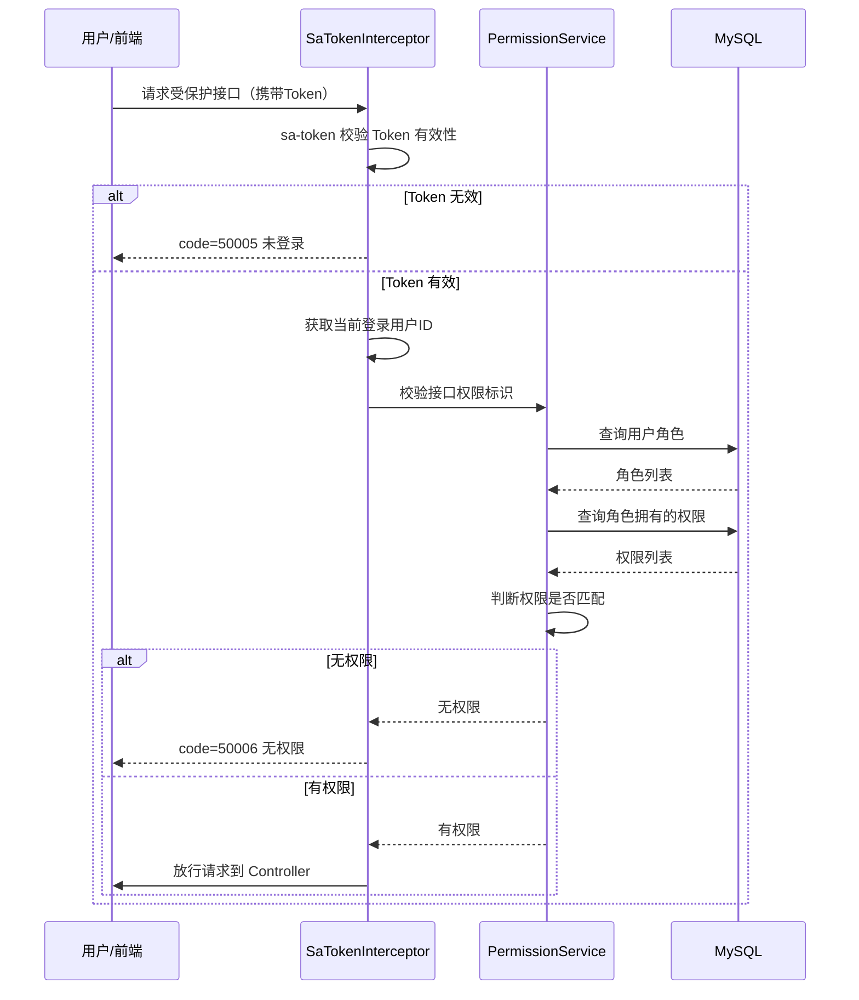
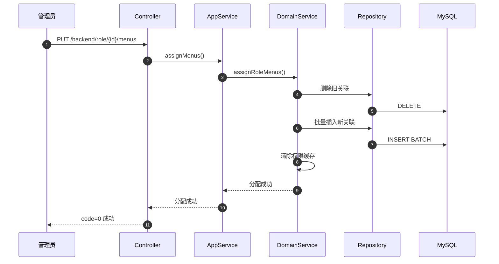
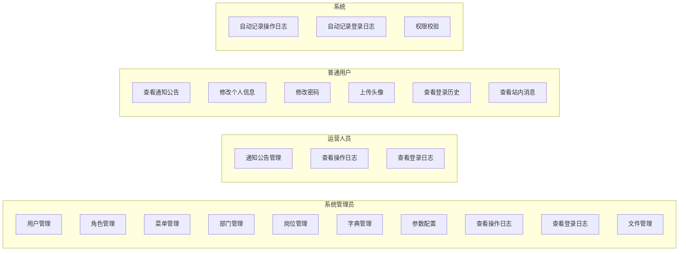

# 技术设计文档
- 版本号: v1.0.0
- 作者: 架构师
- 日期: 2026-05-04
- 关联PRD文档: docs/v1.0.0/PRD文档.md

## 1. 需求背景

基于 PRD 文档，本系统需构建一个前后端分离的通用后台管理系统，核心能力包括 RBAC 权限管理（用户/角色/菜单/部门/岗位）、系统配置（字典/参数/公告）、日志审计（操作日志/登录日志）、文件管理和个人中心。系统需支持 1000 并发在线用户，采用 sa-token 作为安全框架，基于 V3 Admin Vite 前端模板实现现代化管理界面。

## 2. 技术选型

| 层面 | 选型 | 版本 | 选择理由 |
|------|------|------|---------|
| 后端框架 | Spring Boot | 3.3.2 | 成熟稳定，生态丰富，内置 Tomcat，快速启动 |
| ORM 框架 | MyBatis-Plus | 3.5.7 | 简化 CRUD，内置分页插件，代码生成能力强 |
| 安全框架 | sa-token | 1.39.0 | 轻量级，支持登录认证、权限认证、分布式会话，与 Spring Boot 3 兼容良好 |
| 数据库 | MySQL | 8.0 | 关系型数据库，稳定可靠，社区活跃 |
| 连接池 | HikariCP | 内置 | Spring Boot 默认连接池，性能最优 |
| 缓存 | Redis（Redisson） | 最新版 | 后端规范强制要求使用 Redisson 客户端，支持分布式缓存、分布式锁、分布式集合 |
| JSON 处理 | Jackson | 内置 | Spring Boot 默认，性能优秀 |
| 工具库 | Hutool | 5.8.27 | Java 工具集，简化常用操作（日期、加密、文件等） |
| 前端框架 | Vue | 3.4.x | 响应式系统，组合式 API，TypeScript 支持好 |
| 构建工具 | Vite | 5.x | 极速冷启动，HMR 快速，现代化构建 |
| UI 组件库 | Element Plus | 2.7.x | 与 Vue3 深度集成，组件丰富，文档完善 |
| 前端模板 | V3 Admin Vite | 最新版 | 现代化后台模板，已内置权限路由、布局框架、主题切换 |
| HTTP 客户端 | Axios | 1.6.x | 成熟的 HTTP 请求库，支持拦截器 |
| 状态管理 | Pinia | 2.1.x | Vue 官方推荐，TypeScript 友好 |
| 开发语言 | Java / TypeScript | 21 / 5.x | 后端利用 Java 21 新特性（Record、Pattern Matching），前端 TS 类型安全 |

## 3. 系统架构

### 3.1 总体架构

本项目采用**三模块 + 四层架构**设计：

**三模块结构**：
- `base` 模块：公共组件、基础工具类、通用配置
- `sdk` 模块：对外API接口定义、Cmd/DTO、常量定义
- `server` 模块：服务实现层，包含完整的四层架构
- **模块依赖方向**：`server` → `sdk` → `base`

**四层架构（位于 server 模块内）**：
1. **适配层**（Adapter Layer）：Controller、拦截器、AOP、定时任务
2. **应用服务层**（AppService Layer）：业务流程编排、事务控制、权限校验协调
3. **领域服务层**（DomainService Layer）：核心业务逻辑、规则校验、数据计算
4. **基础设施层**（Infrastructure Layer）：数据访问（Mapper/PO）、文件存储、缓存、外部调用



### 3.2 四层架构职责说明

| 层级 | 职责 | 典型类/组件 | 禁止行为 |
|------|------|-----------|---------|
| **适配层** | 接收HTTP请求、参数校验、调用应用服务、返回响应 | Controller、Interceptor、AOP Aspect、全局异常处理器 | 直接调用 Mapper 或执行业务逻辑 |
| **应用服务层** | 业务流程编排、事务控制（@Transactional）、调用领域服务组合完成用例；BO（业务对象）定义在本层，按领域分包于 `application/bo/{领域}/` | XxxAppService、XxxBO | 直接操作数据库（绕过 DomainService） |
| **领域服务层** | 核心业务逻辑实现、业务规则校验、领域计算、调用基础设施层完成数据持久化 | XxxDomainService | 直接处理 HTTP 请求或返回视图对象 |
| **基础设施层** | 数据持久化（Mapper/PO）、文件存储、缓存、消息发送、外部API调用 | Mapper、PO、RepositoryImpl、CacheManager、FileStorage | 包含业务逻辑（仅数据访问和基础设施操作） |

### 3.3 贫血模型设计

本项目采用**贫血模型**（Anemic Domain Model）：
- **领域对象**仅包含数据属性（getter/setter），不包含业务逻辑方法
- **BO（Business Object）**：位于应用层 `application/bo/{领域}/` 包下，作为应用服务的入参/出参对象，如 `UserBO`、`RoleBO`、`DeptBO`，按业务领域分包
- **PO（Persistent Object）**：位于基础设施层 `po` 包下，对应数据库表结构，用于 MyBatis-Plus 映射
- **DO（Data Object）**：位于领域层，作为领域服务的输入/输出参数对象，如 `UserDO`、`RoleDO`
- 所有业务逻辑集中在 **DomainService** 中，保持领域对象的纯粹性

### 3.4 领域划分与包结构

本项目采用**共享层级 + 领域分包**模式：适配层、应用层、基础设施层在所有领域间共享，领域层按业务领域分包。应用层（AppService）可直接调用所有领域层（DomainService）的服务。

#### 3.4.1 领域划分

| 领域 | domain 子包 | 职责 | 对应 DomainService |
|------|------------|------|-------------------|
| auth | `domain/auth/` | sa-token 集成、登录登出、会话管理、密码校验（认证逻辑由 AuthAppService 编排，直接调用 UserDomainService） | 无独立 DomainService |
| user | `domain/user/` | 用户/角色/菜单/部门/岗位 RBAC 核心权限管理 | UserDomainService、RoleDomainService、MenuDomainService、DeptDomainService、PostDomainService |
| config | `domain/config/` | 字典/参数/公告 系统基础配置数据管理 | DictDomainService、ConfigDomainService、NoticeDomainService |
| log | `domain/log/` | 操作日志/登录日志 审计日志记录、查询、导出 | OperLogDomainService、LoginLogDomainService |
| file | `domain/file/` | 文件上传/管理 | FileDomainService |
| profile | `domain/profile/` | 个人中心 | ProfileDomainService |

#### 3.4.2 包结构示例

```
com.example.project.server/
├── ServerApplication.java
├── adapter/                              # 共享适配层
│   └── controller/backend/
│       ├── AuthController.java
│       └── UserController.java
├── application/                          # 共享应用层
│   ├── bo/                               #   BO（应用层业务对象，按领域分包）
│   │   ├── auth/                         #     auth 领域 BO
│   │   │   ├── LoginBO.java              #       登录业务对象
│   │   │   └── LoginResultBO.java        #       登录结果
│   │   ├── user/                         #     user 领域 BO
│   │   │   ├── UserBO.java               #       用户查询结果
│   │   │   └── UserCreateBO.java          #       用户创建参数
│   │   ├── dept/                         #     dept 领域 BO
│   │   ├── menu/                         #     menu 领域 BO
│   │   ├── role/                         #     role 领域 BO
│   │   ├── post/                         #     post 领域 BO
│   │   └── dict/                         #     dict 领域 BO（DictType + DictData）
│   └── service/                          #   应用服务
│       ├── AuthAppService.java
│       ├── UserAppService.java
│       └── impl/
├── domain/                               # 领域层（按业务分包）
│   └── user/                             #   user 领域
│       ├── do_/                          #     DO
│       ├── service/                      #     DomainService
│       └── repository/                   #     仓储接口
├── infrastructure/                       # 共享基础设施层
│   ├── repository/impl/                  #   仓储实现
│   ├── po/                               #   PO
│   ├── mapper/                           #   Mapper
│   ├── convertor/                        #   Convertor
│   ├── query/                            #   查询参数
│   └── remote/                           #   外部系统调用
├── config/                               # 公共配置
├── contract/                             # 公共契约
└── helper/                               # 公共工具
```

> 领域间交互方式：AppService 可直接调用所有领域的 DomainService，无需通过 Remote/Api 机制。`infrastructure/remote/` 仅用于外部第三方系统调用。详见后端编码规范 09b-domain-interaction-rules.md。

## 4. 数据库设计

> 📄 完整数据库设计内容已拆分至独立文档 [数据库设计.md](./数据库设计.md)（ER图、DDL、索引设计、逻辑删除策略）

## 5. API接口设计

> 📄 完整API接口设计内容已拆分至独立文档 [API接口设计.md](./API接口设计.md)（73个接口列表、核心接口详情、响应格式）

## 6. 核心流程设计

### 6.1 总体流程



### 6.2 登录认证流程



### 6.3 RBAC 权限校验流程



### 6.4 菜单权限分配流程



## 7. 用例图



## 8. 安全设计

### 8.1 认证方案
- 采用 **sa-token** 实现登录认证和会话管理
- 登录成功后生成 Token，前端存储于 localStorage
- 每次请求通过 Header 携带 Token（`satoken: xxxxxx`）
- sa-token 配置：
  - Token 有效期：30 分钟
  - 自动续期：每次访问自动续期
  - 登录设备数限制：单设备登录（同一账号新登录踢出旧会话）

### 8.2 授权方案
- RBAC 模型：用户 → 角色 → 菜单/按钮权限
- 权限校验方式：
  - 菜单级：通过 sa-token 的 `@SaCheckLogin` + 自定义权限拦截器
  - 按钮级：通过权限标识字符串匹配（`StpUtil.hasPermission("system:user:add")`）
- 超级管理员（id=1）自动拥有所有权限，跳过校验

### 8.3 数据安全
- 密码存储：BCrypt 加密（盐值自动随机生成）
- 敏感接口参数：不返回密码字段
- SQL 注入防护：MyBatis-Plus 参数化查询
- XSS 防护：前端输出转义 + 后端输入校验
- 文件上传：白名单校验扩展名、限制文件大小、存储路径隔离

### 8.4 登录安全
- 连续 5 次登录失败锁定账号 15 分钟（通过 sa-token 登录失败计数实现）
- 登录日志记录 IP、浏览器、操作系统信息

### 8.5 业务安全约束

- **超级管理员保护**：id=1 的用户为超级管理员，**禁止删除**、**禁止禁用**；对应角色（`admin`）**禁止删除**、**禁止修改权限**
- **部门循环依赖防护**：编辑部门父节点时，后端校验新父节点不能是自身或自身的子部门（递归查询子部门树），防止树形结构出现环
- **密码重置强制修改**：通过 `sys_config` 表配置 `sys.user.forceResetPassword` 参数（默认 `false`），启用后用户重置密码首次登录时强制跳转修改密码页
- **菜单级联删除防护**：存在子菜单的父菜单**禁止删除**，需先删除或移动子菜单

### 8.6 通知实时推送

- 采用 **SSE（Server-Sent Events）** 方案实现公告发布后的在线用户实时提醒
- **推送流程**：
  1. 用户登录后建立 SSE 连接（`GET /backend/system/notice/subscribe`）
  2. 管理员发布公告时，后端通过 Redis Pub/Sub 广播通知消息
  3. 各服务实例收到广播后，向本地维护的 SSE 连接推送通知事件
  4. 前端收到事件后更新顶部导航栏未读数量和铃铛提示
- **连接管理**：用户登出时关闭 SSE 连接；服务端定时心跳检测（30s）清理断开的连接
- **选型理由**：SSE 比 WebSocket 更轻量，仅需服务端向客户端单向推送，无需双向通信；原生浏览器支持，无需额外依赖

## 9. 性能设计

### 9.1 缓存策略
- **缓存框架**：使用 Redisson 客户端操作 Redis，遵循后端编码规范强制要求
- 用户权限缓存：登录时查询用户权限并缓存于 Redis，权限分配变更时清除缓存
- 字典数据缓存：系统启动加载全部字典数据至 Redis，字典变更时刷新缓存
- 参数配置缓存：查询时缓存至 Redis，参数变更时刷新缓存
- 缓存有效期：默认 30 分钟，支持手动刷新
- **禁止直接操作 RedisTemplate**：使用封装好的 Cache 类

### 9.2 分页策略
- 列表查询统一使用 MyBatis-Plus 分页插件（Page 对象）
- 默认每页 10 条，最大每页 100 条（防止超大分页拖垮数据库）
- 日志表查询增加时间范围限制（默认最近 30 天）

### 9.3 异步处理
- 操作日志记录采用 Spring `@Async` 异步写入，避免阻塞主业务线程
- 登录日志记录同样异步处理

### 9.4 数据库优化
- HikariCP 连接池配置：最小空闲 10，最大连接 50，连接超时 30s
- 所有外键关联字段和常用查询字段建立索引（见 4.3 索引设计）
- **日志表**：`sys_oper_log`、`sys_login_log` 数据量较大，定期归档或清理（默认保留 90 天）
- **公告已读记录**：`sys_notice_read` 随公告删除自动清理；对于长期有效的公告，已读记录长期保留
- **文件管理**：`sys_file` 删除时同步清理物理文件；定期扫描孤立文件（数据库记录已删除但物理文件残留）

## 10. 术语表

| 术语 | 解释 |
|------|------|
| sa-token | 轻量级 Java 权限认证框架，支持登录认证、权限认证、分布式会话等 |
| RBAC | Role-Based Access Control，基于角色的访问控制 |
| BCrypt | 一种自适应密码哈希算法，自动包含盐值，安全性高 |
| Redisson | Redisson 是 Redis 的 Java 客户端，提供分布式缓存、分布式锁、分布式集合等功能 |
| HikariCP | 高性能 JDBC 连接池，Spring Boot 默认连接池 |
| AOP | Aspect-Oriented Programming，面向切面编程，用于日志拦截 |
| OSS | Object Storage Service，对象存储服务（如阿里云OSS、AWS S3） |
| UUID | Universally Unique Identifier，通用唯一标识符，用于文件名重命名 |
| RESTful | Representational State Transfer，一种软件架构风格，本系统 API 采用此风格 |
| Token | 访问令牌，用于标识用户身份和会话状态 |

## 11. 评审记录

| 评审人 | 评审意见 | 评审结果 |
|--------|---------|---------|
| 产品经理 | v1.0.0-rev6：领域间交互机制明确，Remote→Api调用链清晰；包结构中remote/与领域包平级设计合理，不影响业务功能；API接口设计完整覆盖PRD需求 ~~（注：rev5/rev6基于旧版领域根包模式+Remote→Api机制，已被rev7架构替代）~~ | 通过 |
| 前端工程师 | v1.0.0-rev6：领域间交互机制为后端内部设计，前端接口调用方式不受影响；API路径、响应格式均无变更 | 通过 |
| 后端工程师 | v1.0.0-rev6：remote/包位于server根包平级，与编码规范09a v2.2、09b v3.1完全一致；调用链AppService→server.remote/XxxRemote→目标领域adapter/api/XxxApi→目标领域AppService清晰明确 ~~（注：已被rev7共享层级+AppService直接调用DomainService模式替代）~~ | 通过 |
| 单元测试工程师 | v1.0.0-rev6：Remote→Api机制可测试性好，Remote类可Mock，Api类委托逻辑简单 ~~（注：已被rev7架构替代）~~ | 通过 |
| 架构师 | v1.0.0-rev12：BO包结构文档-代码一致性审查通过。3.2节应用服务层职责正确补充BO归属；3.3节贫血模型设计正确补充BO定义；3.4.2节包结构示例BO正确位于application/bo/下7个领域分包，domain层不再包含bo子包；变更记录rev12完整；与编码规范09a-domain-package-structure.md完全一致 | 通过 |

## 12. 变更记录

| 版本 | 变更内容 | 变更日期 |
|------|---------|---------|
| v1.0.0 | 初稿 | 2026-05-04 |
| v1.0.0-rev1 | 修正四层架构设计：补充领域服务层，明确适配层→应用服务层→领域服务层→基础设施层调用关系；补充三模块架构和贫血模型设计说明 | 2026-05-04 |
| v1.0.0-rev2 | 优化图表布局（架构图/ER图/时序图精简宽度，提升可读性）；表设计从表格格式改为标准 MySQL DDL 语句；补充 update_time 同步策略、实体删除级联策略、免认证接口说明、数据清理策略 | 2026-05-04 |
| v1.0.0-rev3 | 修正 DDL：为 sys_notice_read、sys_oper_log、sys_login_log 补充 create_time 和 update_time；为 sys_file 补充 update_time；所有非中间表的 update_time 统一增加 `ON UPDATE CURRENT_TIMESTAMP`；更新 4.2 节时间字段维护策略说明 | 2026-05-04 |
| v1.0.0-rev5 | 领域包结构重构：从“每层内按领域分包”改为“每个领域根包包含完整四层架构”；每个领域（systemauth/systemuser/systemconfig/systemlog/systemfile/systemprofile）拥有独立的根包，内含 adapter/application/domain/infrastructure；公共包（config/contract/helper）与领域包平级 | 2026-05-04 |
| v1.0.0-rev7 | 架构模式重大调整：从"领域根包模式"改为"共享层级+领域分包"模式；adapter/application/infrastructure 共享于 server 根包下；domain 按业务分包（auth/user/config/log/file/profile）；移除 Remote→Api 跨域调用机制，改为 AppService 直接调用 DomainService；Remote 包移入 infrastructure/ 下用于外部系统调用 | 2026-05-05 |
| v1.0.0-rev8 | 文档-代码一致性修正：auth领域无独立AuthDomainService，认证逻辑由AuthAppService编排；修正3.1架构图登录流程加入AppService层；修正6.2登录时序图与实际代码一致；标注rev5/rev6评审记录已过时 | 2026-05-05 |
| v1.0.0-rev9 | 架构师全面审查修正：1) DDL字段类型全面符合MySQL规范（tinyint unsigned/char/COLLATE）；业务表增加逻辑删除（is_deleted）；超级管理员保护规则明确；部门循环依赖防护设计完整；SSE实时推送方案满足PRD通知需求；密码重置强制修改配置化设计合理 | 2026-05-05 |
| v1.0.0-rev10 | 软删除策略升级为ID型：is_deleted字段类型从tinyint unsigned改为bigint(20)，删除时is_deleted=记录ID（非固定值1）；唯一索引改为联合唯一索引(业务字段, is_deleted)配合ID型软删除；新增参数校验规范（AppService基本格式校验+DomainService业务规则校验，独立validateXxx方法）；BaseRepositoryImpl覆写removeById实现SET is_deleted=id | 2026-05-05 |
| v1.0.0-rev11 | 软删除实现改为MyBatis-Plus原生方案：logic-delete-value从1改为id（MySQL列引用）、@TableLogic delval从1改为id；移除BaseRepositoryImpl.removeById/removeByIds手动覆写；removeByIds()由逐条更新优化为单条SQL批量更新 | 2026-05-05 |
| v1.0.0-rev12 | 包结构文档-代码一致性修正：BO（业务对象）从domain层移至application层，按领域分包于`application/bo/{领域}/`；更新3.2四层架构职责说明补充BO归属；更新3.3贫血模型设计补充BO定义；更新3.4.2包结构示例将BO从domain下移到application下并展示auth/user/dept/menu/role/post/dict分包；domain层仅保留do_/service/repository | 2026-05-05 |
