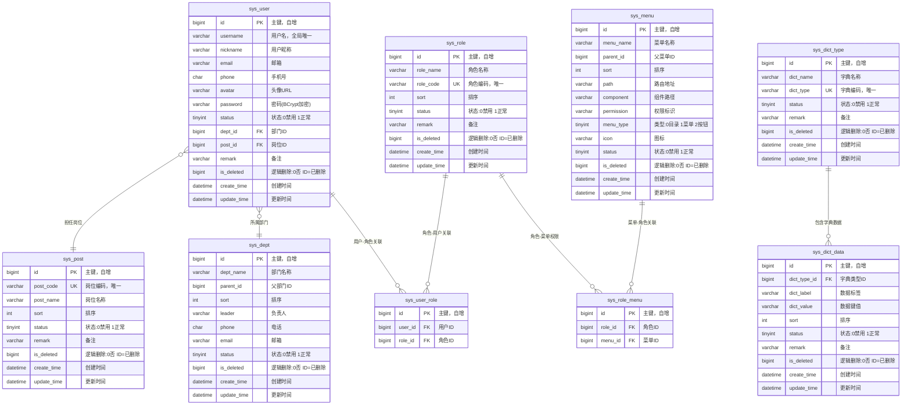

# 技术设计文档 - 数据库设计

- 版本号: v1.0.0
- 关联主文档: docs/v1.0.0/技术设计文档.md
- 本文件为技术设计文档第4节的独立拆分

---

## 4.1 ER图



## 4.2 表设计

以下为可直接执行的 MySQL 8.0 DDL 建表语句。所有表均使用 InnoDB 引擎、utf8mb4 字符集，不创建数据库外键约束，表间关联通过应用层逻辑维护。

> **时间字段维护策略**：
> - `create_time` 由数据库 `DEFAULT CURRENT_TIMESTAMP` 在插入时自动填充。
> - `update_time` 由数据库 `DEFAULT CURRENT_TIMESTAMP ON UPDATE CURRENT_TIMESTAMP` 在记录修改时自动更新，确保数据更新时间的一致性和可靠性。

```sql
CREATE TABLE `sys_user` (
  `id` bigint unsigned NOT NULL AUTO_INCREMENT COMMENT '主键',
  `username` varchar(64) NOT NULL DEFAULT '' COMMENT '用户名，唯一',
  `nickname` varchar(64) NOT NULL DEFAULT '' COMMENT '用户昵称',
  `email` varchar(128) NOT NULL DEFAULT '' COMMENT '邮箱',
  `phone` char(11) NOT NULL DEFAULT '' COMMENT '手机号',
  `avatar` varchar(255) NOT NULL DEFAULT '' COMMENT '头像地址',
  `password` varchar(128) NOT NULL DEFAULT '' COMMENT '加密密码（BCrypt）',
  `status` tinyint unsigned NOT NULL DEFAULT 1 COMMENT '状态：0-禁用，1-正常',
  `dept_id` bigint unsigned DEFAULT NULL COMMENT '所属部门ID',
  `post_id` bigint unsigned DEFAULT NULL COMMENT '岗位ID',
  `remark` varchar(500) NOT NULL DEFAULT '' COMMENT '备注',
  `is_deleted` bigint(20) NOT NULL DEFAULT 0 COMMENT '逻辑删除：0-未删除，非0-已删除（值为被删除记录的ID）',
  `create_time` datetime NOT NULL DEFAULT CURRENT_TIMESTAMP COMMENT '创建时间',
  `update_time` datetime NOT NULL DEFAULT CURRENT_TIMESTAMP ON UPDATE CURRENT_TIMESTAMP COMMENT '更新时间',
  PRIMARY KEY (`id`),
  UNIQUE KEY `uk_username_deleted` (`username`, `is_deleted`),
  KEY `idx_dept_id` (`dept_id`)
) ENGINE=InnoDB DEFAULT CHARSET=utf8mb4 COLLATE=utf8mb4_general_ci COMMENT='用户表';

CREATE TABLE `sys_role` (
  `id` bigint unsigned NOT NULL AUTO_INCREMENT COMMENT '主键',
  `role_name` varchar(64) NOT NULL DEFAULT '' COMMENT '角色名称',
  `role_code` varchar(64) NOT NULL DEFAULT '' COMMENT '角色编码，唯一',
  `sort` int unsigned NOT NULL DEFAULT 0 COMMENT '显示顺序',
  `status` tinyint unsigned NOT NULL DEFAULT 1 COMMENT '状态：0-禁用，1-正常',
  `remark` varchar(500) NOT NULL DEFAULT '' COMMENT '备注',
  `is_deleted` bigint(20) NOT NULL DEFAULT 0 COMMENT '逻辑删除：0-未删除，非0-已删除（值为被删除记录的ID）',
  `create_time` datetime NOT NULL DEFAULT CURRENT_TIMESTAMP COMMENT '创建时间',
  `update_time` datetime NOT NULL DEFAULT CURRENT_TIMESTAMP ON UPDATE CURRENT_TIMESTAMP COMMENT '更新时间',
  PRIMARY KEY (`id`),
  UNIQUE KEY `uk_role_code_deleted` (`role_code`, `is_deleted`)
) ENGINE=InnoDB DEFAULT CHARSET=utf8mb4 COLLATE=utf8mb4_general_ci COMMENT='角色表';

CREATE TABLE `sys_menu` (
  `id` bigint unsigned NOT NULL AUTO_INCREMENT COMMENT '主键',
  `menu_name` varchar(64) NOT NULL DEFAULT '' COMMENT '菜单名称',
  `parent_id` bigint unsigned NOT NULL DEFAULT 0 COMMENT '父菜单ID，0为顶级',
  `sort` int unsigned NOT NULL DEFAULT 0 COMMENT '显示顺序',
  `path` varchar(128) NOT NULL DEFAULT '' COMMENT '路由地址',
  `component` varchar(128) NOT NULL DEFAULT '' COMMENT '组件路径',
  `permission` varchar(128) NOT NULL DEFAULT '' COMMENT '权限标识，如 system:user:add',
  `menu_type` tinyint unsigned NOT NULL COMMENT '类型：0-目录，1-菜单，2-按钮',
  `icon` varchar(64) NOT NULL DEFAULT '' COMMENT '菜单图标',
  `status` tinyint unsigned NOT NULL DEFAULT 1 COMMENT '状态：0-禁用，1-正常',
  `is_deleted` bigint(20) NOT NULL DEFAULT 0 COMMENT '逻辑删除：0-未删除，非0-已删除（值为被删除记录的ID）',
  `create_time` datetime NOT NULL DEFAULT CURRENT_TIMESTAMP COMMENT '创建时间',
  `update_time` datetime NOT NULL DEFAULT CURRENT_TIMESTAMP ON UPDATE CURRENT_TIMESTAMP COMMENT '更新时间',
  PRIMARY KEY (`id`),
  KEY `idx_parent_id` (`parent_id`),
  KEY `idx_menu_type` (`menu_type`)
) ENGINE=InnoDB DEFAULT CHARSET=utf8mb4 COLLATE=utf8mb4_general_ci COMMENT='菜单/权限表';

CREATE TABLE `sys_dept` (
  `id` bigint unsigned NOT NULL AUTO_INCREMENT COMMENT '主键',
  `dept_name` varchar(64) NOT NULL DEFAULT '' COMMENT '部门名称',
  `parent_id` bigint unsigned NOT NULL DEFAULT 0 COMMENT '父部门ID，0为顶级',
  `sort` int unsigned NOT NULL DEFAULT 0 COMMENT '显示顺序',
  `leader` varchar(64) NOT NULL DEFAULT '' COMMENT '负责人',
  `phone` char(11) NOT NULL DEFAULT '' COMMENT '联系电话',
  `email` varchar(128) NOT NULL DEFAULT '' COMMENT '邮箱',
  `status` tinyint unsigned NOT NULL DEFAULT 1 COMMENT '状态：0-禁用，1-正常',
  `is_deleted` bigint(20) NOT NULL DEFAULT 0 COMMENT '逻辑删除：0-未删除，非0-已删除（值为被删除记录的ID）',
  `create_time` datetime NOT NULL DEFAULT CURRENT_TIMESTAMP COMMENT '创建时间',
  `update_time` datetime NOT NULL DEFAULT CURRENT_TIMESTAMP ON UPDATE CURRENT_TIMESTAMP COMMENT '更新时间',
  PRIMARY KEY (`id`),
  KEY `idx_parent_id` (`parent_id`)
) ENGINE=InnoDB DEFAULT CHARSET=utf8mb4 COLLATE=utf8mb4_general_ci COMMENT='部门表';

CREATE TABLE `sys_post` (
  `id` bigint unsigned NOT NULL AUTO_INCREMENT COMMENT '主键',
  `post_code` varchar(64) NOT NULL DEFAULT '' COMMENT '岗位编码，唯一',
  `post_name` varchar(64) NOT NULL DEFAULT '' COMMENT '岗位名称',
  `sort` int unsigned NOT NULL DEFAULT 0 COMMENT '显示顺序',
  `status` tinyint unsigned NOT NULL DEFAULT 1 COMMENT '状态：0-禁用，1-正常',
  `remark` varchar(500) NOT NULL DEFAULT '' COMMENT '备注',
  `is_deleted` bigint(20) NOT NULL DEFAULT 0 COMMENT '逻辑删除：0-未删除，非0-已删除（值为被删除记录的ID）',
  `create_time` datetime NOT NULL DEFAULT CURRENT_TIMESTAMP COMMENT '创建时间',
  `update_time` datetime NOT NULL DEFAULT CURRENT_TIMESTAMP ON UPDATE CURRENT_TIMESTAMP COMMENT '更新时间',
  PRIMARY KEY (`id`),
  UNIQUE KEY `uk_post_code_deleted` (`post_code`, `is_deleted`)
) ENGINE=InnoDB DEFAULT CHARSET=utf8mb4 COLLATE=utf8mb4_general_ci COMMENT='岗位表';

CREATE TABLE `sys_user_role` (
  `id` bigint unsigned NOT NULL AUTO_INCREMENT COMMENT '主键',
  `user_id` bigint unsigned NOT NULL COMMENT '用户ID',
  `role_id` bigint unsigned NOT NULL COMMENT '角色ID',
  PRIMARY KEY (`id`),
  UNIQUE KEY `uk_user_role` (`user_id`, `role_id`),
  KEY `idx_role_id` (`role_id`)
) ENGINE=InnoDB DEFAULT CHARSET=utf8mb4 COLLATE=utf8mb4_general_ci COMMENT='用户角色关联表';

CREATE TABLE `sys_role_menu` (
  `id` bigint unsigned NOT NULL AUTO_INCREMENT COMMENT '主键',
  `role_id` bigint unsigned NOT NULL COMMENT '角色ID',
  `menu_id` bigint unsigned NOT NULL COMMENT '菜单ID',
  PRIMARY KEY (`id`),
  UNIQUE KEY `uk_role_menu` (`role_id`, `menu_id`),
  KEY `idx_menu_id` (`menu_id`)
) ENGINE=InnoDB DEFAULT CHARSET=utf8mb4 COLLATE=utf8mb4_general_ci COMMENT='角色菜单关联表';

CREATE TABLE `sys_dict_type` (
  `id` bigint unsigned NOT NULL AUTO_INCREMENT COMMENT '主键',
  `dict_name` varchar(64) NOT NULL DEFAULT '' COMMENT '字典名称',
  `dict_type` varchar(64) NOT NULL DEFAULT '' COMMENT '字典类型编码，唯一',
  `status` tinyint unsigned NOT NULL DEFAULT 1 COMMENT '状态：0-禁用，1-正常',
  `remark` varchar(500) NOT NULL DEFAULT '' COMMENT '备注',
  `is_deleted` bigint(20) NOT NULL DEFAULT 0 COMMENT '逻辑删除：0-未删除，非0-已删除（值为被删除记录的ID）',
  `create_time` datetime NOT NULL DEFAULT CURRENT_TIMESTAMP COMMENT '创建时间',
  `update_time` datetime NOT NULL DEFAULT CURRENT_TIMESTAMP ON UPDATE CURRENT_TIMESTAMP COMMENT '更新时间',
  PRIMARY KEY (`id`),
  UNIQUE KEY `uk_dict_type_deleted` (`dict_type`, `is_deleted`)
) ENGINE=InnoDB DEFAULT CHARSET=utf8mb4 COLLATE=utf8mb4_general_ci COMMENT='字典类型表';

CREATE TABLE `sys_dict_data` (
  `id` bigint unsigned NOT NULL AUTO_INCREMENT COMMENT '主键',
  `dict_type_id` bigint unsigned NOT NULL COMMENT '字典类型ID',
  `dict_label` varchar(64) NOT NULL DEFAULT '' COMMENT '数据标签',
  `dict_value` varchar(64) NOT NULL DEFAULT '' COMMENT '数据键值',
  `sort` int unsigned NOT NULL DEFAULT 0 COMMENT '显示顺序',
  `status` tinyint unsigned NOT NULL DEFAULT 1 COMMENT '状态：0-禁用，1-正常',
  `remark` varchar(500) NOT NULL DEFAULT '' COMMENT '备注',
  `is_deleted` bigint(20) NOT NULL DEFAULT 0 COMMENT '逻辑删除：0-未删除，非0-已删除（值为被删除记录的ID）',
  `create_time` datetime NOT NULL DEFAULT CURRENT_TIMESTAMP COMMENT '创建时间',
  `update_time` datetime NOT NULL DEFAULT CURRENT_TIMESTAMP ON UPDATE CURRENT_TIMESTAMP COMMENT '更新时间',
  PRIMARY KEY (`id`),
  KEY `idx_dict_type_id` (`dict_type_id`)
) ENGINE=InnoDB DEFAULT CHARSET=utf8mb4 COLLATE=utf8mb4_general_ci COMMENT='字典数据表';

CREATE TABLE `sys_config` (
  `id` bigint unsigned NOT NULL AUTO_INCREMENT COMMENT '主键',
  `config_name` varchar(64) NOT NULL DEFAULT '' COMMENT '参数名称',
  `config_key` varchar(64) NOT NULL DEFAULT '' COMMENT '参数键名，唯一',
  `config_value` varchar(500) NOT NULL DEFAULT '' COMMENT '参数键值',
  `is_system` tinyint unsigned NOT NULL DEFAULT 0 COMMENT '是否系统内置：0-否，1-是',
  `remark` varchar(500) NOT NULL DEFAULT '' COMMENT '备注',
  `is_deleted` bigint(20) NOT NULL DEFAULT 0 COMMENT '逻辑删除：0-未删除，非0-已删除（值为被删除记录的ID）',
  `create_time` datetime NOT NULL DEFAULT CURRENT_TIMESTAMP COMMENT '创建时间',
  `update_time` datetime NOT NULL DEFAULT CURRENT_TIMESTAMP ON UPDATE CURRENT_TIMESTAMP COMMENT '更新时间',
  PRIMARY KEY (`id`),
  UNIQUE KEY `uk_config_key_deleted` (`config_key`, `is_deleted`)
) ENGINE=InnoDB DEFAULT CHARSET=utf8mb4 COLLATE=utf8mb4_general_ci COMMENT='参数配置表';

CREATE TABLE `sys_notice` (
  `id` bigint unsigned NOT NULL AUTO_INCREMENT COMMENT '主键',
  `title` varchar(128) NOT NULL DEFAULT '' COMMENT '公告标题',
  `content` text DEFAULT NULL COMMENT '公告内容',
  `notice_type` tinyint unsigned NOT NULL DEFAULT 1 COMMENT '类型：1-通知，2-公告',
  `status` tinyint unsigned NOT NULL DEFAULT 0 COMMENT '状态：0-草稿，1-已发布，2-已撤回',
  `publisher_id` bigint unsigned NOT NULL COMMENT '发布人ID',
  `publish_time` datetime DEFAULT NULL COMMENT '发布时间',
  `is_deleted` bigint(20) NOT NULL DEFAULT 0 COMMENT '逻辑删除：0-未删除，非0-已删除（值为被删除记录的ID）',
  `create_time` datetime NOT NULL DEFAULT CURRENT_TIMESTAMP COMMENT '创建时间',
  `update_time` datetime NOT NULL DEFAULT CURRENT_TIMESTAMP ON UPDATE CURRENT_TIMESTAMP COMMENT '更新时间',
  PRIMARY KEY (`id`),
  KEY `idx_status` (`status`)
) ENGINE=InnoDB DEFAULT CHARSET=utf8mb4 COLLATE=utf8mb4_general_ci COMMENT='通知公告表';

CREATE TABLE `sys_notice_read` (
  `id` bigint unsigned NOT NULL AUTO_INCREMENT COMMENT '主键',
  `notice_id` bigint unsigned NOT NULL COMMENT '公告ID',
  `user_id` bigint unsigned NOT NULL COMMENT '用户ID',
  `read_time` datetime NOT NULL DEFAULT CURRENT_TIMESTAMP COMMENT '阅读时间',
  `create_time` datetime NOT NULL DEFAULT CURRENT_TIMESTAMP COMMENT '创建时间',
  `update_time` datetime NOT NULL DEFAULT CURRENT_TIMESTAMP ON UPDATE CURRENT_TIMESTAMP COMMENT '更新时间',
  PRIMARY KEY (`id`),
  UNIQUE KEY `uk_notice_user` (`notice_id`, `user_id`)
) ENGINE=InnoDB DEFAULT CHARSET=utf8mb4 COLLATE=utf8mb4_general_ci COMMENT='公告已读记录表';

CREATE TABLE `sys_oper_log` (
  `id` bigint unsigned NOT NULL AUTO_INCREMENT COMMENT '主键',
  `title` varchar(64) NOT NULL DEFAULT '' COMMENT '操作模块标题',
  `oper_type` tinyint unsigned DEFAULT NULL COMMENT '操作类型：1-新增，2-修改，3-删除，4-查询，5-其他',
  `method` varchar(256) NOT NULL DEFAULT '' COMMENT '请求方法名',
  `request_method` varchar(16) NOT NULL DEFAULT '' COMMENT '请求方式：GET/POST/PUT/DELETE',
  `oper_url` varchar(255) NOT NULL DEFAULT '' COMMENT '请求URL',
  `oper_ip` varchar(64) NOT NULL DEFAULT '' COMMENT '操作IP',
  `oper_location` varchar(64) NOT NULL DEFAULT '' COMMENT '操作地点',
  `oper_param` text DEFAULT NULL COMMENT '请求参数',
  `json_result` text DEFAULT NULL COMMENT '返回结果',
  `status` tinyint unsigned NOT NULL DEFAULT 0 COMMENT '状态：0-正常，1-异常',
  `error_msg` text DEFAULT NULL COMMENT '错误信息',
  `oper_time` datetime NOT NULL COMMENT '操作时间',
  `cost_time` bigint unsigned NOT NULL DEFAULT 0 COMMENT '执行耗时(ms)',
  `create_time` datetime NOT NULL DEFAULT CURRENT_TIMESTAMP COMMENT '创建时间',
  `update_time` datetime NOT NULL DEFAULT CURRENT_TIMESTAMP ON UPDATE CURRENT_TIMESTAMP COMMENT '更新时间',
  PRIMARY KEY (`id`),
  KEY `idx_oper_time` (`oper_time`),
  KEY `idx_oper_ip` (`oper_ip`)
) ENGINE=InnoDB DEFAULT CHARSET=utf8mb4 COLLATE=utf8mb4_general_ci COMMENT='操作日志表';

CREATE TABLE `sys_login_log` (
  `id` bigint unsigned NOT NULL AUTO_INCREMENT COMMENT '主键',
  `username` varchar(64) NOT NULL DEFAULT '' COMMENT '用户名称',
  `ip` varchar(64) NOT NULL DEFAULT '' COMMENT '登录IP',
  `location` varchar(64) NOT NULL DEFAULT '' COMMENT '登录地点',
  `browser` varchar(64) NOT NULL DEFAULT '' COMMENT '浏览器',
  `os` varchar(64) NOT NULL DEFAULT '' COMMENT '操作系统',
  `status` tinyint unsigned NOT NULL DEFAULT 0 COMMENT '状态：0-成功，1-失败',
  `msg` varchar(255) NOT NULL DEFAULT '' COMMENT '提示消息',
  `login_time` datetime NOT NULL COMMENT '登录时间',
  `create_time` datetime NOT NULL DEFAULT CURRENT_TIMESTAMP COMMENT '创建时间',
  `update_time` datetime NOT NULL DEFAULT CURRENT_TIMESTAMP ON UPDATE CURRENT_TIMESTAMP COMMENT '更新时间',
  PRIMARY KEY (`id`),
  KEY `idx_login_time` (`login_time`),
  KEY `idx_username` (`username`)
) ENGINE=InnoDB DEFAULT CHARSET=utf8mb4 COLLATE=utf8mb4_general_ci COMMENT='登录日志表';

CREATE TABLE `sys_file` (
  `id` bigint unsigned NOT NULL AUTO_INCREMENT COMMENT '主键',
  `file_name` varchar(128) NOT NULL DEFAULT '' COMMENT '原文件名',
  `file_path` varchar(255) NOT NULL DEFAULT '' COMMENT '存储路径',
  `file_size` bigint unsigned NOT NULL DEFAULT 0 COMMENT '文件大小(bytes)',
  `file_type` varchar(64) NOT NULL DEFAULT '' COMMENT '文件类型',
  `url` varchar(255) NOT NULL DEFAULT '' COMMENT '访问URL',
  `create_by` bigint unsigned DEFAULT NULL COMMENT '上传人ID',
  `is_deleted` bigint(20) NOT NULL DEFAULT 0 COMMENT '逻辑删除：0-未删除，非0-已删除（值为被删除记录的ID）',
  `create_time` datetime NOT NULL DEFAULT CURRENT_TIMESTAMP COMMENT '创建时间',
  `update_time` datetime NOT NULL DEFAULT CURRENT_TIMESTAMP ON UPDATE CURRENT_TIMESTAMP COMMENT '更新时间',
  PRIMARY KEY (`id`),
  KEY `idx_create_by` (`create_by`)
) ENGINE=InnoDB DEFAULT CHARSET=utf8mb4 COLLATE=utf8mb4_general_ci COMMENT='文件管理表';
```

## 4.3 索引设计

以上 DDL 语句已为各表创建完整索引，各表索引清单如下：

- **sys_user**: `uk_username_deleted`（联合唯一索引，username + is_deleted）、`idx_dept_id`（普通索引，dept_id）
- **sys_role**: `uk_role_code_deleted`（联合唯一索引，role_code + is_deleted）
- **sys_menu**: `idx_parent_id`（普通索引，parent_id）、`idx_menu_type`（普通索引，menu_type）
- **sys_dept**: `idx_parent_id`（普通索引，parent_id）
- **sys_post**: `uk_post_code_deleted`（联合唯一索引，post_code + is_deleted）
- **sys_user_role**: `uk_user_role`（联合唯一索引，user_id + role_id）、`idx_role_id`（普通索引，role_id）
- **sys_role_menu**: `uk_role_menu`（联合唯一索引，role_id + menu_id）、`idx_menu_id`（普通索引，menu_id）
- **sys_dict_type**: `uk_dict_type_deleted`（联合唯一索引，dict_type + is_deleted）
- **sys_dict_data**: `idx_dict_type_id`（普通索引，dict_type_id）
- **sys_config**: `uk_config_key_deleted`（联合唯一索引，config_key + is_deleted）
- **sys_notice**: `idx_status`（普通索引，status）
- **sys_notice_read**: `uk_notice_user`（联合唯一索引，notice_id + user_id）
- **sys_oper_log**: `idx_oper_time`（普通索引，oper_time）、`idx_oper_ip`（普通索引，oper_ip）
- **sys_login_log**: `idx_login_time`（普通索引，login_time）、`idx_username`（普通索引，username）
- **sys_file**: `idx_create_by`（普通索引，create_by）

索引设计原则：
1. 业务唯一性字段使用联合唯一索引（`UNIQUE KEY(业务字段, is_deleted)`）保障数据一致性，配合 ID 型软删除方案（`is_deleted` 存储记录 ID），实现删除后重建同名记录的能力。
2. 高频查询条件字段建立普通索引（`KEY`）提升查询性能。
3. 关联表使用联合唯一索引防止重复数据，同时为反向查询字段建立普通索引。

## 4.4 逻辑删除与级联策略

所有业务表采用**ID 型逻辑删除**（`is_deleted` 字段），符合 MySQL 设计规范"业务数据禁止物理删除"的强制要求。仅日志表（`sys_oper_log`、`sys_login_log`）和纯关联中间表（`sys_user_role`、`sys_role_menu`）采用物理删除。

> **逻辑删除实现**：`is_deleted` 字段类型为 `bigint(20)`，`0` 表示未删除，删除时将 `is_deleted` 设为**记录自身的 ID 值**（即 `is_deleted = id`）。
> - MyBatis-Plus 原生配置 `logic-delete-value: id`（MySQL 列引用）、`logic-not-delete-value: 0`，查询时自动追加 `WHERE is_deleted = 0` 条件，删除时自动生成 `SET is_deleted = id`。
> - PO 实体通过 `@TableLogic(value = "0", delval = "id")` 注解声明，`delval = "id"` 使 MyBatis-Plus 将 `id` 直接嵌入 SQL 的 SET 子句作为列引用，而非参数绑定。
> - `BaseRepositoryImpl` **不需要**覆写 `removeById()`，MyBatis-Plus 原生机制已完整支持 ID 型软删除。
> - 此设计的核心优势：联合唯一索引 `(业务字段, is_deleted)` 中，未删除记录 `is_deleted = 0` 确保唯一性，已删除记录 `is_deleted = 记录ID` 各不相同，支持删除后重建同名记录。

| 操作实体 | 删除方式 | 级联行为 | 约束说明 |
|---------|---------|---------|---------|
| 删除用户 | 逻辑删除（`is_deleted=记录ID`） | 同步逻辑删除该用户的 `sys_user_role` 关联记录；保留 `sys_oper_log`、`sys_login_log`、`sys_notice_read`、`sys_file` 历史数据 | 超级管理员（id=1）**禁止删除**和**禁止禁用** |
| 删除角色 | 逻辑删除（`is_deleted=记录ID`） | 同步物理删除 `sys_user_role` 和 `sys_role_menu` 关联记录 | 超级管理员角色**禁止删除**和**禁止修改权限** |
| 删除部门 | 逻辑删除（`is_deleted=记录ID`） | **禁止删除**（若该部门下存在未删除的用户） | 返回业务错误，要求先迁移或删除部门下用户 |
| 删除岗位 | 逻辑删除（`is_deleted=记录ID`） | **禁止删除**（若该岗位下存在未删除的用户） | 返回业务错误，要求先迁移或删除岗位下用户 |
| 删除菜单 | 逻辑删除（`is_deleted=记录ID`） | 同步物理删除 `sys_role_menu` 关联记录；存在子菜单时**禁止删除**，需先删除子菜单 | 菜单删除后相关角色自动失去该权限 |
| 删除字典类型 | 逻辑删除（`is_deleted=记录ID`） | 同步逻辑删除该类型下所有 `sys_dict_data` 记录 | 系统内置字典类型（`is_system=1`）**禁止删除** |
| 删除字典数据 | 逻辑删除（`is_deleted=记录ID`） | 无级联 | 同一字典类型下数据键值唯一 |
| 删除参数配置 | 逻辑删除（`is_deleted=记录ID`） | 无级联 | 系统内置参数（`is_system=1`）**禁止删除** |
| 删除公告 | 逻辑删除（`is_deleted=记录ID`） | 同步物理删除 `sys_notice_read` 已读记录 | 公告删除后清理冗余的已读标记 |
| 删除文件 | 逻辑删除（`is_deleted=记录ID`） | 逻辑删除数据库记录，物理文件保留（定期清理孤立文件） | 数据库记录与物理文件解耦 |
| 清理操作日志 | 物理删除 | `DELETE FROM sys_oper_log WHERE oper_time < ?` | 定期清理，默认保留 90 天 |
| 清理登录日志 | 物理删除 | `DELETE FROM sys_login_log WHERE login_time < ?` | 定期清理，默认保留 90 天 |

> **唯一索引与逻辑删除**：采用 ID 型软删除方案（`is_deleted` 存储记录 ID 而非固定值 `1`），唯一索引改为联合唯一索引 `(业务字段, is_deleted)`。未删除记录 `is_deleted = 0` 确保唯一性；已删除记录 `is_deleted = 记录ID` 各不相同，允许多条同名已删除记录共存，支持删除后重建同名记录。例如 `uk_username(username)` 改为 `uk_username_deleted(username, is_deleted)`。

