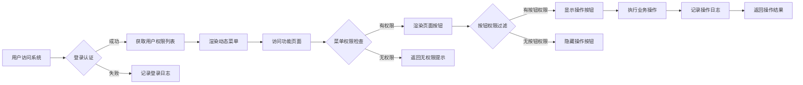

# 项目概要

## 1. 项目基本信息
- 项目名称: 通用后台管理系统（类若依）
- 创建日期: 2026-05-04
- 当前版本: v1.0.0
- 技术栈: Spring Boot 3.3.2 + MyBatis-Plus + sa-token + Java 21 + Vue 3 + Vite + TypeScript 5.x + MySQL 8.0

## 2. 业务架构

### 2.1 业务领域划分
系统分为五大业务域：

| 业务域 | 包含模块 | 说明 |
|--------|---------|------|
| 权限管理域 | 用户管理、角色管理、菜单管理、部门管理、岗位管理 | RBAC权限体系核心，支持菜单级+按钮级双级权限控制 |
| 系统配置域 | 字典管理、参数配置、通知公告 | 系统基础数据与配置 |
| 日志审计域 | 操作日志、登录日志 | 系统行为记录与安全审计 |
| 个人中心域 | 个人信息、密码修改、头像上传、登录历史、站内消息 | 用户自助服务 |
| 文件管理域 | 文件上传、文件管理、头像管理 | 系统附件资源管理 |

### 2.2 核心业务流程



## 3. 技术架构

### 3.1 总体架构图

```
┌─────────────────────────────────────────────────────────────┐
│                        前端层 (Vue 3)                        │
│  V3 Admin Vite 模板 + TypeScript 5.x + Element Plus         │
│  权限路由 · 动态菜单 · 按钮级权限控制 · Axios 请求封装      │
│  v-permission指令(基于permissions数组) · usePermission函数   │
└─────────────────────────────────────────────────────────────┘
                              │
                              ▼ HTTP/RESTful API
┌─────────────────────────────────────────────────────────────┐
│                      网关/控制层                             │
│  Spring Boot 3.3.2 + sa-token 认证授权拦截                  │
│  统一异常处理 · 日志拦截 · 接口权限校验                       │
└─────────────────────────────────────────────────────────────┘
                              │
┌─────────────────────────────────────────────────────────────┐
│                      业务服务层                              │
│  MyBatis-Plus 数据访问 · 业务逻辑 · RBAC 权限计算           │
│  文件存储服务 · 日志记录服务 · 字典参数服务                   │
│  菜单/按钮权限标识计算 · 角色权限查询                         │
└─────────────────────────────────────────────────────────────┘
                              │
┌─────────────────────────────────────────────────────────────┐
│                      数据存储层                              │
│  MySQL 8.0 业务数据 · 本地文件存储（预留对象存储扩展）       │
└─────────────────────────────────────────────────────────────┘
```

### 3.2 技术选型
| 层面 | 技术 | 版本 |
|------|------|------|
| 后端框架 | Spring Boot | 3.3.2 |
| ORM 框架 | MyBatis-Plus | 3.5.9 (spring-boot3-starter) |
| 安全框架 | sa-token | 1.39.0 |
| 数据库 | MySQL | 8.0 |
| 缓存 | Redis（sa-token 会话存储） | 7.x |
| 前端框架 | Vue | 3.x |
| 构建工具 | Vite | 最新稳定版 |
| 开发语言 | Java / TypeScript | 21 / 5.x |
| 前端模板 | V3 Admin Vite | 最新版 |
| 前端权限控制 | v-permission指令 + usePermission组合式函数 | - |

### 3.3 数据库设计概要
核心表包括：
- `sys_user` 用户表
- `sys_role` 角色表
- `sys_menu` 菜单/权限表（menuType: 1=目录, 2=菜单, 3=按钮，按钮级权限通过permission字段标识）
- `sys_dept` 部门表
- `sys_post` 岗位表
- `sys_user_role` 用户角色关联表
- `sys_role_menu` 角色菜单关联表
- `sys_dict_type` / `sys_dict_data` 字典表
- `sys_config` 参数配置表
- `sys_notice` 通知公告表
- `sys_oper_log` 操作日志表
- `sys_login_log` 登录日志表
- `sys_file` 文件管理表

#### 按钮级权限标识一览
| 模块 | 权限标识 |
|------|----------|
| 用户管理 | system:user:add / system:user:edit / system:user:remove / system:user:resetPwd |
| 角色管理 | system:role:add / system:role:edit / system:role:remove |
| 菜单管理 | system:menu:add / system:menu:edit / system:menu:remove |
| 部门管理 | system:dept:add / system:dept:edit / system:dept:remove |
| 岗位管理 | system:post:add / system:post:edit / system:post:remove |
| 字典管理 | system:dict:add / system:dict:edit / system:dict:remove |
| 参数配置 | system:config:add / system:config:edit / system:config:remove |
| 通知公告 | system:notice:add / system:notice:edit / system:notice:remove / system:notice:publish / system:notice:withdraw |
| 文件管理 | system:file:upload / system:file:remove |
| 操作日志 | system:operLog:clean |
| 登录日志 | system:loginLog:clean |

## 4. 项目里程碑

| 阶段 | 状态 | 产出物 |
|------|------|--------|
| 需求采集 | 已完成 | 需求采集文档 |
| 产品设计 | 已完成 | PRD文档 |
| 技术设计 | 已完成 | 技术设计文档、API接口设计、数据库设计 |
| 测试用例 | 已完成 | 单元测试用例文档、集成测试用例文档 |
| 编码 | 已完成 | 后端（Spring Boot 3）、前端（Vue 3） |
| Code Review | 已完成 | 代码评审通过 |
| 单元测试 | 已完成 | 单元测试报告（81个用例，100%通过） |
| 集成测试 | 已完成 | 集成测试报告（86个用例，100%通过）、E2E集成测试报告（33+42个用例，3个BUG已修复回归通过） |
| 交付 | 已完成 | v1.0.0 版本交付 |
